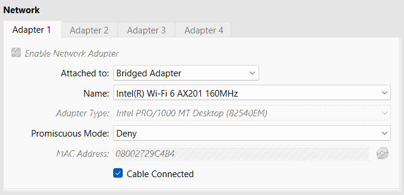
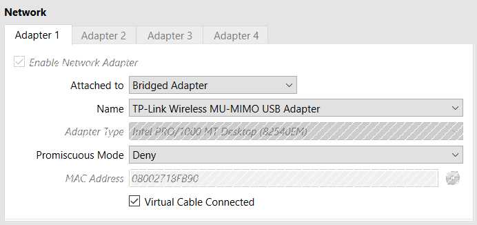
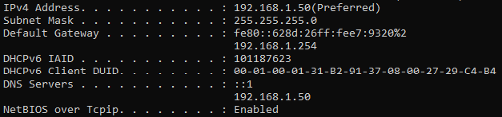
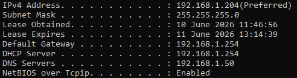

# Environment Setup

Before Active Directory can work, the network has to be configured in the right way: the server needs a fixed address, the clients need to reach it, and DNS queries for the lab domain need to go to the server.

This stage prepares the base environment before `AD-SRV01` is promoted into a Domain Controller (DC).

## Host Layout

The lab uses three Oracle VirtualBox (VBox) virtual machines (VMs) split across separate physical laptops on the same home Wi-Fi network.

| Host Role     | Virtual Machine | Purpose                                                                                        |
| ------------- | --------------- | ---------------------------------------------------------------------------------------------- |
| Server Host   | `AD-SRV01`      | Windows Server 2022 system prepared for domain services.                                       |
| Client Host 1 | `AD-WIN10-01`   | Windows 10 Pro client used for domain join and workstation validation.                         |
| Client Host 2 | `AD-WIN10-02`   | Second Windows 10 Pro client used to confirm the setup works across more than one workstation. |

The machines are not shown together in one VirtualBox console because they run on different physical laptops. They still behave as one lab environment because they share the same local network.

## VirtualBox Network

Each virtual machine uses VirtualBox Bridged Adapter mode.

Bridged networking makes each VM appear as its own device on the home network. This allows the server and clients to communicate through the same router while still running as virtual machines.

### Work Path

```text
VirtualBox Manager -> Select VM -> Settings -> Network -> Adapter 1
```

`AD-SRV01` uses Bridged Adapter mode through the host Wi-Fi adapter, as shown in Figure 2.1.



*Figure 2.1 - VirtualBox network settings for `AD-SRV01`, showing Adapter 1 set to Bridged Adapter mode through the host wireless adapter.*

The Windows 10 clients use the same bridged networking pattern. One client example is shown in Figure 2.2, with the same approach used for both clients.



*Figure 2.2 - VirtualBox network settings for a Windows 10 client, showing Adapter 1 set to Bridged Adapter mode on the same home network pattern.*

## IP Addressing

`AD-SRV01` uses a static Internet Protocol version 4 (IPv4) address so the clients have a reliable target for Domain Name System (DNS) and upcoming Active Directory Domain Services (AD DS).

### Server Work Path

```text
Win + R -> ncpa.cpl -> Network Connections -> Ethernet -> Properties -> Internet Protocol Version 4 (TCP/IPv4) -> Properties
```

### Server Action

```text
Set static IPv4 address, subnet mask, default gateway, and preferred DNS server.
```

The Windows 10 clients receive their IPv4 addresses from the EE router through Dynamic Host Configuration Protocol (DHCP).

| Device        | Addressing                | IPv4 Address    |
| ------------- | ------------------------- | --------------- |
| `AD-SRV01`    | Static                    | `192.168.1.50`  |
| `AD-WIN10-01` | Router DHCP               | `192.168.1.204` |
| `AD-WIN10-02` | Router DHCP               | `192.168.1.102` |
| EE Router     | Gateway and DHCP Provider | `192.168.1.254` |

This keeps the setup simple. The router handles normal client addressing, while the server keeps a fixed address for Active Directory and DNS.

## DNS Path

`AD-SRV01` is configured to use itself for DNS, as shown in Figure 2.3.



*Figure 2.3 - IPv4 configuration on `AD-SRV01`, showing the static server address and preferred DNS server set to the server itself.*

The Windows 10 clients keep router-provided IP addressing, but their preferred DNS server is manually set to:

```text
192.168.1.50
```

### Client Work Path

```text
Win + R -> ncpa.cpl -> Network Connections -> Ethernet -> Properties -> Internet Protocol Version 4 (TCP/IPv4) -> Properties
```

### Client Action

```text
Keep IP address assignment automatic.
Set preferred DNS server to 192.168.1.50.
```

That sends `adbox.local` lookups to `AD-SRV01`. A client example is shown in Figure 2.4.



*Figure 2.4 - IPv4 configuration on a Windows 10 client, showing automatic IP addressing with DNS manually pointed to `192.168.1.50`.*

This DNS path matters because Windows clients need to find the Domain Controller before they can join the domain or authenticate against it.

## Adapter Setting

Internet Protocol version 6 (IPv6) was disabled on the Windows 10 lab adapters after testing showed that the clients were receiving router-provided IPv6 DNS information.

### Client Work Path

```text
Win + R -> ncpa.cpl -> Network Connections -> Ethernet -> Properties
```

### Client Action

```text
Untick Internet Protocol Version 6 (TCP/IPv6) on the lab client adapters.
```

Figure 2.5 shows the client adapter after IPv6 was unticked.


*Figure 2.5 - Windows 10 client adapter properties with IPv6 unticked so the lab stays on the intended IPv4 DNS path.*

With IPv6 enabled, the clients were not consistently using the intended DNS path for the lab domain. Disabling IPv6 kept the environment on the controlled IPv4 path through `AD-SRV01`.

The full issue is documented in [DNS IPv6 Conflict](../troubleshooting/01-dns-ipv6-conflict.md).

## Validation Checks

Before moving into the Domain Controller build, each client needed to prove three things: server reachability, lab domain resolution, and full server-name resolution.

### Client Work Path

```text
Win + R -> cmd
```

### Run On

```text
AD-WIN10-01
AD-WIN10-02
```

| Check                       | Command                         | Expected Result                                   |
| --------------------------- | ------------------------------- | ------------------------------------------------- |
| Server Reach                | `ping 192.168.1.50`             | Client can communicate with `AD-SRV01`.           |
| Lab Domain Resolution       | `nslookup adbox.local`          | Client receives a response through lab DNS.       |
| Server Full Name Resolution | `nslookup AD-SRV01.adbox.local` | Client can locate `AD-SRV01` by full domain name. |

`AD-SRV01.adbox.local` is the server Fully Qualified Domain Name (FQDN). It combines the hostname and domain name into one complete DNS name.

```text
AD-SRV01              = hostname
adbox.local           = domain
AD-SRV01.adbox.local  = full DNS name
```

These checks confirm that the base network and DNS path are ready before installing and promoting Active Directory Domain Services.

## Navigation

| Previous                              | Current              | Next                                            |
| ------------------------------------- | ---------------------| ----------------------------------------------- |
| [01 Lab Overview](01-lab-overview.md) | 02 Environment Setup | [03 Domain Controller](03-domain-controller.md) |
