# Domain Controller

The Domain Controller stage is where the prepared server becomes the identity and Domain Name System (DNS) centre of the lab.

`AD-SRV01` already has the network base from the environment setup: bridged networking, a static Internet Protocol version 4 (IPv4) address, and DNS pointed to itself. This page records the Active Directory Domain Services (AD DS) role installation, promotion into a new forest, expected wizard warnings, and the checks used after restart.

## Build Steps

The Domain Controller (DC) build followed the Server Manager promotion workflow from role installation to post-promotion validation.

| Step | Action               | Covers                                                              |
| ---- | -------------------- | ------------------------------------------------------------------- |
| 01   | Confirm Server Base  | Static IP, bridged networking, and DNS pointed to `AD-SRV01`.       |
| 02   | Install AD DS        | Active Directory Domain Services role added through Server Manager. |
| 03   | Start Promotion      | Post-deployment task used to promote the server.                    |
| 04   | Create New Forest    | `adbox.local` created as the root domain.                           |
| 05   | Set DC Options       | DNS and Global Catalog enabled; writable DC selected.               |
| 06   | Review DNS Warning   | Expected delegation warning checked and accepted.                   |
| 07   | Confirm NetBIOS Name | `ADBOX` detected as the short domain name.                          |
| 08   | Keep Default Paths   | AD database, logs, and SYSVOL left on default paths.                |
| 09   | Run Prerequisites    | Promotion checks passed without blocking errors.                    |
| 10   | Restart Into Domain  | Server restarted under the `ADBOX` domain context.                  |
| 11   | Validate Roles       | Server Manager confirmed AD DS and DNS roles.                       |
| 12   | Validate Domain      | ADUC, DNS, and `nslookup` confirmed the domain was working.         |

## Starting Point

`AD-SRV01` was prepared before promotion so the domain had a stable network base.

| Setting              | Value                                   |
| -------------------- | --------------------------------------- |
| Server Name          | `AD-SRV01`                              |
| Operating System     | Windows Server 2022 Standard Evaluation |
| Static IPv4 Address  | `192.168.1.50`                          |
| Preferred DNS        | `192.168.1.50`                          |
| Planned Domain       | `adbox.local`                           |
| Planned NetBIOS Name | `ADBOX`                                 |

The static IP matters because Windows clients need a reliable DNS and domain target. The server DNS points to itself because the Domain Controller also provides DNS for the lab domain.

These settings are covered in [02 Environment Setup](02-environment-setup.md).

## AD DS Role Installation

The Active Directory Domain Services role was selected through the Add Roles and Features Wizard.

### Work Path

```text
Server Manager -> Manage -> Add Roles and Features -> Role-based or feature-based installation -> Select AD-SRV01 -> Server Roles -> Active Directory Domain Services
```

Figure 3.1 shows the AD DS role selected before installation.

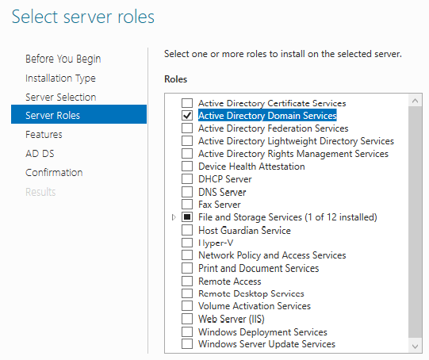

*Figure 3.1 - Add Roles and Features Wizard showing `Active Directory Domain Services` selected for installation on `AD-SRV01`.*

Installing the role adds the components needed for the server to provide directory services. At this point, the AD DS role is installed, but the server still needs promotion before it can act as a Domain Controller.

After installation, Server Manager showed the post-deployment task to promote the server, shown in Figure 3.2.

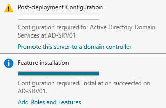

*Figure 3.2 - Server Manager notification showing the post-deployment task to promote `AD-SRV01` to a Domain Controller.*

## New Forest Creation

`AD-SRV01` was promoted using the **Add a new forest** option.

### Work Path

```text
Server Manager -> Notification flag -> Promote this server to a domain controller -> Deployment Configuration -> Add a new forest
```

The root domain name used was:

```text
adbox.local
```

Figure 3.3 shows the new forest configuration.

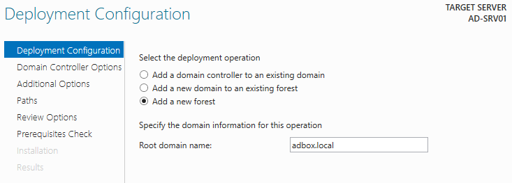

*Figure 3.3 - AD DS Configuration Wizard showing `adbox.local` entered as the root domain name for the new forest.*

This created the first domain in a new Active Directory forest for the lab.

## Domain Controller Options

The promotion wizard configured `AD-SRV01` as the first Domain Controller for the lab domain.

### Work Path

```text
AD DS Configuration Wizard -> Domain Controller Options
```

### Action

```text
Leave DNS Server and Global Catalog selected.
Leave Read-only domain controller unselected.
Set the Directory Services Restore Mode password.
```

| Option                      | Setting                    |
| --------------------------- | -------------------------- |
| DNS Server                  | Enabled                    |
| Global Catalog              | Enabled                    |
| Read-Only Domain Controller | Disabled                   |
| Domain Controller Type      | Writable Domain Controller |

Figure 3.4 shows the Domain Controller options used during promotion.

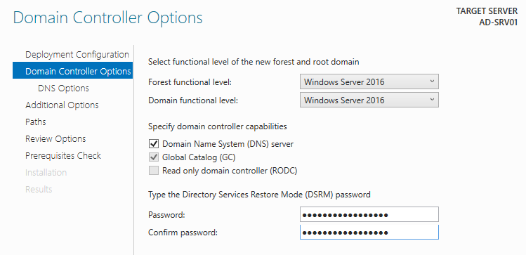

*Figure 3.4 - Domain Controller options showing DNS Server and Global Catalog enabled, with Read-only domain controller left unselected.*

DNS was enabled because the clients need to resolve `adbox.local` and locate domain services. Global Catalog was enabled because this is the first Domain Controller in the domain.

The Directory Services Restore Mode (DSRM) password was set during promotion. The password is not stored in the repository.

## DNS Delegation Warning

The wizard displayed a DNS delegation warning.

### Work Path

```text
AD DS Configuration Wizard -> DNS Options
```

### Action

```text
Review the warning and continue.
```

Figure 3.5 shows the DNS delegation warning.

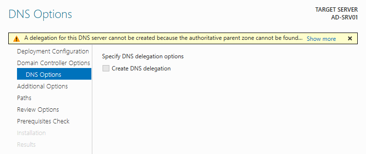

*Figure 3.5 - DNS Options page showing the expected delegation warning during promotion of the first Domain Controller.*

DNS delegation is used when a parent DNS zone points a child domain to the DNS servers responsible for that child domain. The warning appeared because `adbox.local` is an internal lab domain and there is no parent DNS zone configured to delegate it to `AD-SRV01`.

The warning did not block promotion because the Windows clients are configured to use `AD-SRV01` directly for `adbox.local` DNS lookups.

## NetBIOS Name

The wizard detected the NetBIOS domain name as:

```text
ADBOX
```

### Work Path

```text
AD DS Configuration Wizard -> Additional Options
```

### Action

```text
Confirm the detected NetBIOS domain name.
```

Figure 3.6 shows the detected NetBIOS domain name.

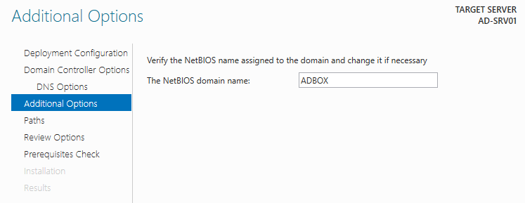

*Figure 3.6 - Additional Options page showing `ADBOX` detected as the NetBIOS domain name for `adbox.local`.*

The NetBIOS domain name is the short Windows name for the domain. In this lab, `ADBOX` is the short name used for the full domain `adbox.local`.

Both names can be used during sign-in, but they appear in different formats.

| Format                    | Example                  | Meaning                                          |
| ------------------------- | ------------------------ | ------------------------------------------------ |
| NetBIOS logon name        | `ADBOX\sam.taylor`       | Uses the short Windows domain name.              |
| User Principal Name (UPN) | `sam.taylor@adbox.local` | Uses the full domain name in email-style format. |

Both formats are used later in the lab when testing domain sign-in, account recovery, Remote Desktop access, and file-share access.

## Directory Paths

The default AD DS database, log, and SYSVOL paths were kept.

### Work Path

```text
AD DS Configuration Wizard -> Paths
```

### Action

```text
Keep the default database, log, and SYSVOL locations.
```

| Path Type        | Location            |
| ---------------- | ------------------- |
| Database Folder  | `C:\Windows\NTDS`   |
| Log Files Folder | `C:\Windows\NTDS`   |
| SYSVOL Folder    | `C:\Windows\SYSVOL` |

Figure 3.7 shows the default AD DS paths.

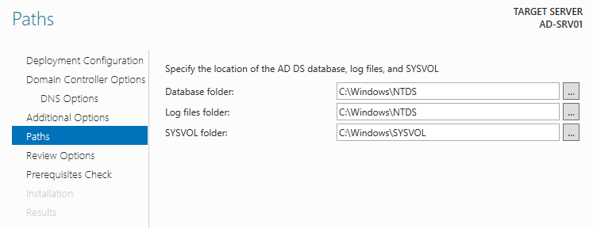

*Figure 3.7 - Paths page showing the default locations for the AD DS database, log files, and SYSVOL folder.*

`NTDS` is the folder used by Active Directory Domain Services for the directory database and related log files. The main database file is `NTDS.dit`, which stores domain objects such as users, computers, groups, Organisational Units (OUs), and directory configuration.

`SYSVOL` is a shared folder used by Domain Controllers to store domain-wide files such as Group Policy content and logon scripts. Clients need access to SYSVOL so they can read policy files and domain scripts during normal domain operation.

The default paths are suitable for this single-server lab because `AD-SRV01` is the only Domain Controller and the environment does not need separate storage volumes.

## Prerequisites Check

The prerequisites check passed before promotion.

### Work Path

```text
AD DS Configuration Wizard -> Prerequisites Check
```

### Action

```text
Confirm there are no blocking errors, then install.
```

Figure 3.8 shows the successful prerequisites check.

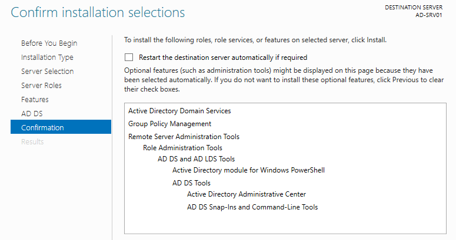

*Figure 3.8 - Prerequisites Check page showing that all checks passed successfully before installation.*

The wizard showed warnings, but there were no blocking errors. After the check passed, the promotion completed and the server restarted.

## Post-Promotion Sign-In

After restart, the sign-in context showed the `ADBOX` domain, shown in Figure 3.9.

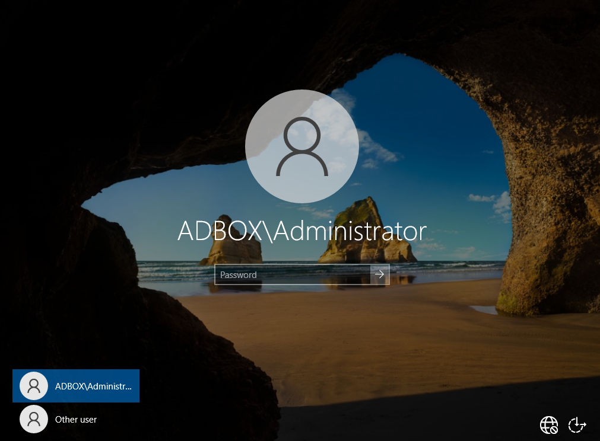

*Figure 3.9 - Windows sign-in screen after restart, showing the server operating under the `ADBOX` domain context.*

This confirmed that the server was operating inside the new `adbox.local` domain.

## Server Manager Validation

Server Manager confirmed the domain membership and installed roles.

### Work Path

```text
Server Manager -> Local Server
```

### Check

```text
Review computer name, domain, IP address, and installed roles.
```

Figure 3.10 shows Server Manager after promotion.

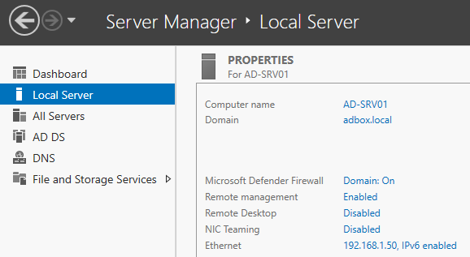

*Figure 3.10 - Server Manager showing `AD-SRV01` joined to `adbox.local`, with AD DS and DNS visible after promotion.*

| Check         | Result         |
| ------------- | -------------- |
| Computer Name | `AD-SRV01`     |
| Domain        | `adbox.local`  |
| Server IP     | `192.168.1.50` |
| Roles Visible | AD DS and DNS  |

This confirmed that the server identity, domain membership, and core roles were visible after promotion.

## DNS Validation

The DNS role was visible in Server Manager, with `AD-SRV01` listed as the DNS server for the lab address.

### Work Path

```text
Server Manager -> Tools -> DNS -> AD-SRV01 -> Forward Lookup Zones -> adbox.local
```

### Check

```text
Confirm that AD-SRV01 is available as the DNS server and the adbox.local zone is visible.
```

Figure 3.11 shows the `adbox.local` DNS zone.

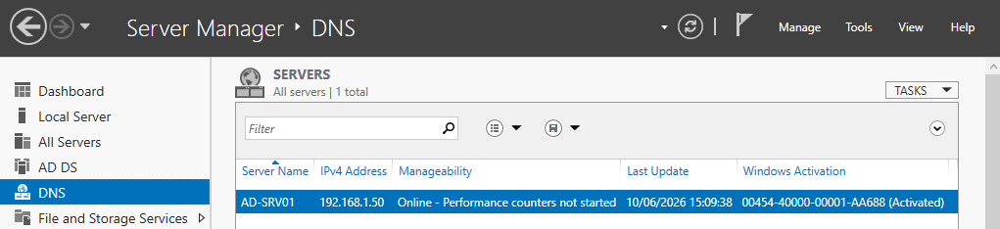

*Figure 3.11 - DNS Manager showing the `adbox.local` forward lookup zone available on `AD-SRV01`.*

A server-side lookup for the lab domain also returned the expected result.

### Work Path

```text
Win + R -> cmd
```

### Run On

```text
AD-SRV01
```

```cmd
nslookup adbox.local
```

Figure 3.12 shows the successful lookup.

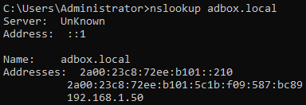

*Figure 3.12 - Command Prompt output showing `nslookup adbox.local` resolving successfully from `AD-SRV01`.*

This confirmed that `AD-SRV01` could resolve the lab domain after promotion.

## Active Directory Validation

Active Directory Users and Computers showed the `adbox.local` domain.

### Work Path

```text
Server Manager -> Tools -> Active Directory Users and Computers
```

### Shortcut

```text
Win + R -> dsa.msc
```

### Check

```text
Confirm that adbox.local is visible and AD-SRV01 appears under Domain Controllers.
```

Figure 3.13 shows the domain in Active Directory Users and Computers (ADUC).

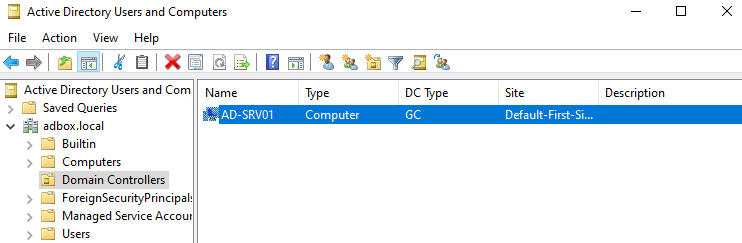

*Figure 3.13 - Active Directory Users and Computers showing the `adbox.local` domain with `AD-SRV01` listed under Domain Controllers.*

`AD-SRV01` was listed under Domain Controllers, confirming that the server object exists in the expected domain location.

## Result

`AD-SRV01` was promoted as the first Domain Controller for `adbox.local`.

The server now provides:

| Service                          | Purpose                                                                              |
| -------------------------------- | ------------------------------------------------------------------------------------ |
| Active Directory Domain Services | Stores and manages users, computers, groups, OUs, and domain objects.                |
| Lab Domain DNS                   | Resolves `adbox.local` and helps clients locate domain services.                     |
| Global Catalog                   | Supports directory lookups inside the domain.                                        |
| Domain Authentication            | Allows future Windows 10 clients to authenticate domain users and computer accounts. |

The next stage tests whether the Windows 10 clients can use this domain and DNS setup to join `adbox.local`.

## Navigation

| Previous                                        | Current              | Next                                |
| ----------------------------------------------- | -------------------- | ----------------------------------- |
| [02 Environment Setup](02-environment-setup.md) | 03 Domain Controller | [04 Domain Join](04-domain-join.md) |
