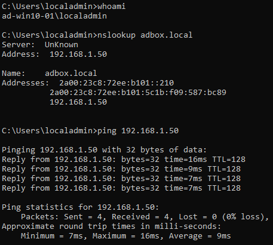
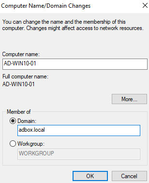
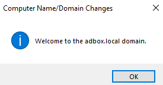
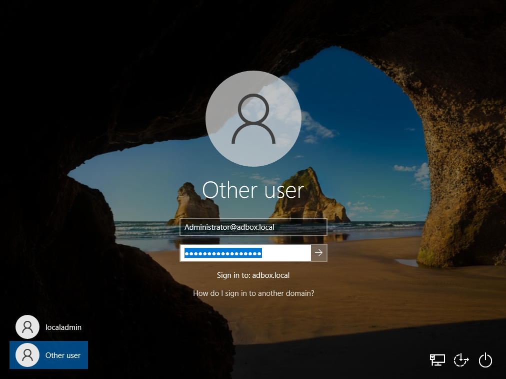
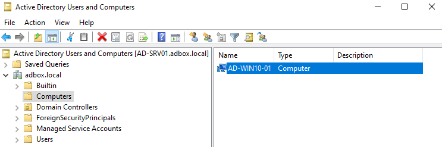

# Domain Join

Domain Join is the first point where the client machines prove that the server build works from the workstation side.

The Domain Controller (DC) and Domain Name System (DNS) service are already in place. This stage checks the client DNS path, joins both Windows 10 machines to `adbox.local`, tests domain sign-in, and confirms that Active Directory created the computer objects.

## Join Target

The join process was tested with two Windows 10 clients.

| Area                        | Value                                |
| --------------------------- | ------------------------------------ |
| Domain                      | `adbox.local`                        |
| Domain Controller           | `AD-SRV01`                           |
| Client 1                    | `AD-WIN10-01`                        |
| Client 2                    | `AD-WIN10-02`                        |
| Client DNS                  | `192.168.1.50`                       |
| Join Account                | `Administrator@adbox.local`          |
| Admin Confirmation Tool | Active Directory Users and Computers |

## Join Steps

The same process was used on both Windows 10 clients.

| Step | Action | Covers |
|---|---|---|
| 01 | Confirm Client DNS | Client hostname, DNS server, server reachability, lab domain lookup, and full server-name lookup. |
| 02 | Open Join Dialog | Windows System Properties used to reach the domain join controls. |
| 03 | Enter Domain Name | `adbox.local` entered as the target domain. |
| 04 | Authenticate Join | Domain administrator credentials used to approve the join. |
| 05 | Restart Client | Windows restarted to apply domain membership. |
| 06 | Domain Account Sign In | Domain sign-in tested after restart. |
| 07 | Confirm Computer Object | Joined workstation checked in Active Directory Users and Computers. |

## Pre-Join Checks

Before attempting the join, `AD-WIN10-01` was checked from the client side. The same checks were repeated on `AD-WIN10-02`.

### Work Path

```text
Win + R -> cmd
```

### Run On

```text
AD-WIN10-01
AD-WIN10-02
```

| Check                       | Command                         | Expected Result                                   |
| --------------------------- | ------------------------------- | ------------------------------------------------- |
| Client Hostname             | `hostname`                      | Client returns its own workstation name.          |
| Client DNS Server           | `ipconfig /all`                 | DNS server shows `192.168.1.50`.                  |
| Server Reach                | `ping 192.168.1.50`             | Client can communicate with `AD-SRV01`.           |
| Lab Domain Resolution       | `nslookup adbox.local`          | Client receives a response through lab DNS.       |
| Server Full Name Resolution | `nslookup AD-SRV01.adbox.local` | Client can locate `AD-SRV01` by full domain name. |

Figure 4.1 shows the client-side DNS and connectivity checks before the domain join.



*Figure 4.1 - Command Prompt output from `AD-WIN10-01` showing hostname, DNS configuration, server reachability, lab domain resolution, and full server-name resolution before joining the domain.*

Domain join depends heavily on DNS. A client can have working internet access and still fail domain join if it is using the router or public DNS instead of the Domain Controller for `adbox.local` lookups.

These checks confirmed that the client could reach `AD-SRV01` and use the lab DNS path before the domain join was attempted.

## Joining AD-WIN10-01

The client was joined through the Windows System Properties dialog.

### Work Path

```text
Win + R -> sysdm.cpl -> Computer Name -> Change
```

### Action

```text
Select Domain and enter adbox.local.
```

The domain entered was:

```text
adbox.local
```

Figure 4.2 shows the domain join dialog with `adbox.local` entered as the target domain.



*Figure 4.2 - Windows Computer Name/Domain Changes dialog showing `adbox.local` entered as the domain for `AD-WIN10-01`.*

Windows then requested credentials with permission to join the computer to the domain.

The join was approved using the User Principal Name (UPN) format:

```text
Administrator@adbox.local
```

`Administrator@adbox.local` identifies the account and the domain together, which makes the sign-in target clear during the join.

The join completed successfully and Windows confirmed that the client had joined the `adbox.local` domain, as shown in Figure 4.3.



*Figure 4.3 - Windows confirmation message showing that `AD-WIN10-01` successfully joined the `adbox.local` domain.*

After the success message, the client was restarted so Windows could apply the domain membership change.

## Domain Sign-In

After restart, `AD-WIN10-01` allowed sign-in with a domain account.

### Work Path

```text
Windows sign-in screen -> Other user
```

### Action

```text
Enter domain credentials.
```

The account used was:

```text
Administrator@adbox.local
```

Figure 4.4 shows the Windows sign-in screen using the domain account format.



*Figure 4.4 - Windows sign-in screen on `AD-WIN10-01`, showing domain sign-in using `Administrator@adbox.local` after the join and restart.*

This confirmed that the workstation could authenticate against the domain and operate as a domain-joined client.

## Joining AD-WIN10-02

The same process was repeated on `AD-WIN10-02`.

The client DNS path was checked first, then the machine was joined to:

```text
adbox.local
```

After restart, the client was able to use domain sign-in in the same way as `AD-WIN10-01`.

## Active Directory Confirmation

After both clients were joined, Active Directory Users and Computers was checked on `AD-SRV01`.

### Work Path

```text
Server Manager -> Tools -> Active Directory Users and Computers -> adbox.local -> Computers
```

### Shortcut

```text
Win + R -> dsa.msc
```

### Check

```text
Confirm that AD-WIN10-01 and AD-WIN10-02 appear in the default Computers container.
```

| Client        | Domain Join State       |
| ------------- | ----------------------- |
| `AD-WIN10-01` | Joined to `adbox.local` |
| `AD-WIN10-02` | Joined to `adbox.local` |

Figure 4.5 shows both computer objects in Active Directory Users and Computers.



*Figure 4.5 - Active Directory Users and Computers showing `AD-WIN10-01` and `AD-WIN10-02` created in the default `Computers` container after domain join.*

Both Windows 10 clients appeared in the default `Computers` container.

New domain-joined Windows computers are placed in the default `Computers` container first. In the next stage, the workstation objects are moved into a dedicated Workstations Organisational Unit (OU) so policies and administration tasks can target them cleanly.

## Result

Both Windows 10 clients joined the `adbox.local` domain successfully.

| Check                                         | Result |
| --------------------------------------------- | ------ |
| Client DNS pointed to `AD-SRV01`              | Passed |
| Client resolved `adbox.local`                 | Passed |
| `AD-WIN10-01` joined the domain               | Passed |
| `AD-WIN10-02` joined the domain               | Passed |
| Domain sign-in worked after restart           | Passed |
| Computer objects appeared in Active Directory | Passed |

The lab is now ready for directory organisation: moving workstation objects, creating users, building groups, and preparing the structure used by later Group Policy and access-control tests.

## Navigation

| Previous                                        | Current        | Next                                                |
| ----------------------------------------------- | -------------- | --------------------------------------------------- |
| [03 Domain Controller](03-domain-controller.md) | 04 Domain Join | [05 Directory Structure](05-directory-structure.md) |
