# Directory Structure

The directory structure stage turns a working domain into something easier to administer.

After both clients joined `adbox.local`, the default Active Directory locations were no longer enough for the rest of the lab. This stage creates a dedicated Organisational Unit (OU) structure, moves the workstations, creates department users, builds security groups, and validates membership.

## Directory Target

The structure is built under a dedicated lab OU.

| Area             | Value                                |
| ---------------- | ------------------------------------ |
| Domain           | `adbox.local`                        |
| Top-Level Lab OU | `ADBox-Lab`                          |
| Workstations     | `AD-WIN10-01`, `AD-WIN10-02`         |
| Department Users | IT, Sales, Warehouse                 |
| Main Tool        | Active Directory Users and Computers |
| Shortcut         | `dsa.msc`                            |

## Build Steps

The directory structure was built after both Windows 10 clients joined `adbox.local`.

| Step | Action                    | Covers                                                                                  |
| ---- | ------------------------- | --------------------------------------------------------------------------------------- |
| 01   | Review Default Containers | Check the starting Active Directory locations created with the domain.                  |
| 02   | Create Lab OU Structure   | Add `ADBox-Lab` with separate areas for users, computers, groups, and service accounts. |
| 03   | Move Workstations         | Move `AD-WIN10-01` and `AD-WIN10-02` into the `Workstations` OU.                        |
| 04   | Create Department Users   | Add example IT, Sales, and Warehouse users.                                             |
| 05   | Create Security Groups    | Add Global Security groups for department membership and Remote Desktop access.         |
| 06   | Set Group Membership      | Add users to the correct groups and correct an intentional membership mistake.          |
| 07   | Validate Objects          | Confirm users and groups can be found in Active Directory Users and Computers.          |

## Default Containers

After the domain was created, Active Directory created several default containers and OUs under `adbox.local`.

### Work Path

```text
Server Manager -> Tools -> Active Directory Users and Computers -> adbox.local
```

### Shortcut

```text
Win + R -> dsa.msc
```

Figure 5.1 shows the default Active Directory locations created with the domain.

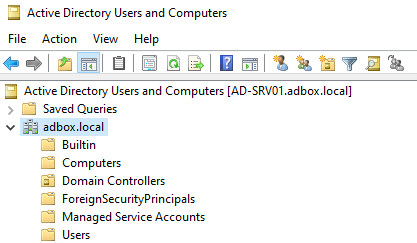

*Figure 5.1 - Active Directory Users and Computers showing the default containers and OUs created under `adbox.local`.*

| Default Location            | Purpose                                                           |
| --------------------------- | ----------------------------------------------------------------- |
| `Builtin`                   | Stores built-in administrative and security groups.               |
| `Computers`                 | Default container where newly joined computer objects are placed. |
| `Domain Controllers`        | Default OU for Domain Controllers.                                |
| `ForeignSecurityPrincipals` | Used for identities from trusted external domains or forests.     |
| `Managed Service Accounts`  | Stores managed service account objects.                           |
| `Users`                     | Default container for built-in users and groups.                  |

Containers can store objects, but Group Policy targeting works cleanly through OUs. For this lab, the working users, groups, and workstations were placed under a dedicated OU structure so later stages can target them clearly.

`AD-SRV01` was left in the default `Domain Controllers` OU. Domain Controllers are placed there automatically and receive Domain Controller-specific policies, so the server object was kept in its expected location.

## OU Structure

A dedicated `ADBox-Lab` OU was created under `adbox.local`.

### Work Path

```text
Active Directory Users and Computers -> adbox.local
```

### Action

```text
Context menu on adbox.local -> New -> Organizational Unit -> Create ADBox-Lab
```

Child OUs were then created inside `ADBox-Lab` for users, computers, groups, and service accounts.

Figure 5.2 shows the completed OU structure.

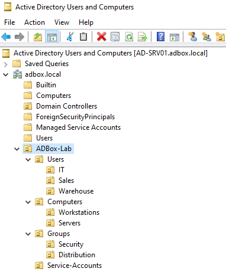

*Figure 5.2 - Active Directory Users and Computers showing the `ADBox-Lab` OU with separate areas for users, computers, groups, and service accounts.*

The final OU structure was:

```text
adbox.local
│
└── ADBox-Lab
    │
    ├── Users
    │   ├── IT
    │   ├── Sales
    │   └── Warehouse
    │
    ├── Computers
    │   ├── Workstations
    │   └── Servers
    │
    ├── Groups
    │   ├── Security
    │   └── Distribution
    │
    └── Service-Accounts
```

| Area               | Purpose                                                              |
| ------------------ | -------------------------------------------------------------------- |
| `Users`            | Stores human user accounts separated by department.                  |
| `Computers`        | Stores workstation and server computer objects.                      |
| `Groups`           | Stores group objects used for access control and administration.     |
| `Service-Accounts` | Reserved for future service, automation, or scheduled task accounts. |

The `Distribution` OU was included as a separate location for mail-related distribution groups. The access-control work in this stage uses Security groups.

No service accounts were created in this stage. The OU was added so the structure has a clear place for future service or automation accounts.

## Computer Placement

When `AD-WIN10-01` and `AD-WIN10-02` joined the domain, their computer objects were created in the default `Computers` container.

### Work Path

```text
Active Directory Users and Computers -> adbox.local -> Computers
```

### Action

```text
Select AD-WIN10-01 and AD-WIN10-02 -> Context menu -> Move -> ADBox-Lab -> Computers -> Workstations
```

The joined workstation objects were moved into:

```text
ADBox-Lab -> Computers -> Workstations
```

Figure 5.3 shows the move dialog used to place the joined clients into the Workstations OU.

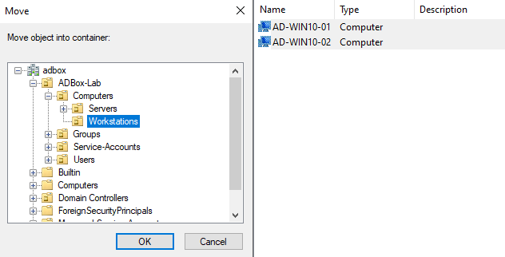

*Figure 5.3 - Move dialog showing the joined Windows 10 computer objects being moved into `ADBox-Lab -> Computers -> Workstations`.*

After the move, both Windows 10 client objects were visible inside the `Workstations` OU, as shown in Figure 5.4.

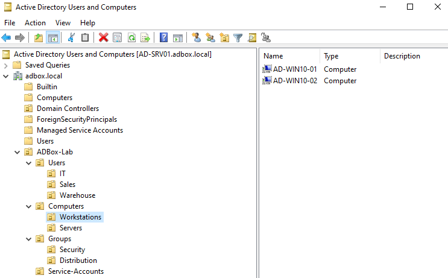

*Figure 5.4 - Active Directory Users and Computers showing `AD-WIN10-01` and `AD-WIN10-02` inside the dedicated `Workstations` OU.*

This prepares the clients for workstation-specific Group Policy settings later in the lab.

## User Accounts

Three department users were created in the `Users` OU structure.

### Work Path

```text
Active Directory Users and Computers -> ADBox-Lab -> Users -> Department OU
```

### Action

```text
Context menu on department OU -> New -> User
```

| Department OU | User         | User Principal Name        |
| ------------- | ------------ | -------------------------- |
| `IT`          | Alex Morgan  | `alex.morgan@adbox.local`  |
| `Sales`       | Jamie Carter | `jamie.carter@adbox.local` |
| `Warehouse`   | Sam Taylor   | `sam.taylor@adbox.local`   |

A User Principal Name (UPN) is the email-style sign-in name for a domain user. In this lab, the UPN format is:

```text
username@adbox.local
```

Figure 5.5 shows the creation of the IT user account for Alex Morgan.

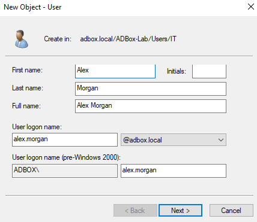

*Figure 5.5 - New Object - User dialog showing the creation of the `alex.morgan` account under the IT user structure.*

During account creation, **User must change password at next logon** was selected, as shown in Figure 5.6.

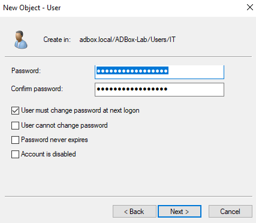

*Figure 5.6 - User password options showing `User must change password at next logon` selected during account creation.*

This matches a common onboarding pattern: the administrator sets a temporary password, and the user is forced to create their own password at first sign-in.

The created user object was confirmed in Active Directory Users and Computers, shown in Figure 5.7.

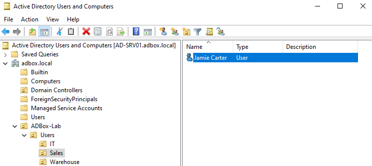

*Figure 5.7 - Active Directory Users and Computers showing the created user object in the lab directory structure.*

The ADUC Find tool was also used to confirm that all three user accounts could be located under the lab structure.

### Work Path

```text
Active Directory Users and Computers -> Context menu on domain or OU -> Find
```

Figure 5.8 shows the search result for the lab user accounts.

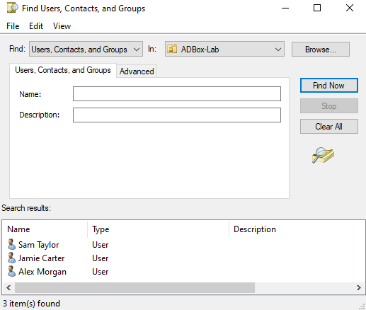

*Figure 5.8 - ADUC Find results showing the three lab-created users: Alex Morgan, Jamie Carter, and Sam Taylor.*

## Group Type and Scope

Active Directory groups have a type and a scope. The type controls what the group is used for. The scope controls where the group can be used.

| Option       | Meaning                                                          | Lab Decision                                                              |
| ------------ | ---------------------------------------------------------------- | ------------------------------------------------------------------------- |
| Security     | Used to assign permissions and access to resources.              | Used for access-control and administration scenarios.                     |
| Distribution | Used for email distribution lists.                               | Reserved outside this stage because the lab is focused on access control. |
| Global       | Used to group users from the same domain.                        | Used because all ADBox users are in `adbox.local`.                        |
| Domain Local | Often used to assign permissions to resources inside the domain. | Covered later when resource permissions are tested.                       |
| Universal    | Used across multiple domains in a forest.                        | Outside the current single-domain design.                                 |

The lab groups were created as Global Security groups. That fits the current design because the users and resources are all inside one domain.

## Security Groups

Security groups were created inside:

```text
ADBox-Lab -> Groups -> Security
```

### Work Path

```text
Active Directory Users and Computers -> ADBox-Lab -> Groups -> Security
```

### Action

```text
Context menu on Security OU -> New -> Group
```

Figure 5.9 shows `GG_IT_Users` being created as a Global Security group.

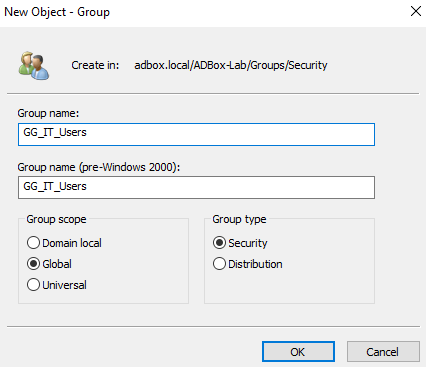

*Figure 5.9 - New Object - Group dialog showing `GG_IT_Users` created as a Global Security group.*

The following security groups were created:

| Group                | Purpose                                                            |
| -------------------- | ------------------------------------------------------------------ |
| `GG_IT_Users`        | Groups IT department users.                                        |
| `GG_Sales_Users`     | Groups Sales department users.                                     |
| `GG_Warehouse_Users` | Groups Warehouse department users.                                 |
| `GG_RDP_Allowed`     | Prepares an access-control group for later Remote Desktop testing. |

Figure 5.10 shows the created security groups listed in ADUC.

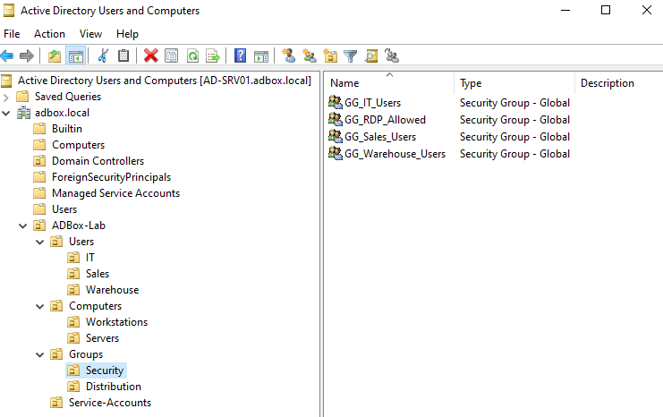

*Figure 5.10 - Active Directory Users and Computers showing the created Global Security groups inside the lab Security OU.*

The `GG_` prefix is used here to mark these as Global Groups. It keeps the group type visible in the object name during later access-control testing.

## Group Membership

Users were added to security groups to connect department users with access-control objects.

### Work Path

```text
Active Directory Users and Computers -> ADBox-Lab -> Groups -> Security -> Group Properties -> Members
```

### Action

```text
Add the correct user account, then confirm the final membership.
```

| Group                | Final Member |
| -------------------- | ------------ |
| `GG_IT_Users`        | Alex Morgan  |
| `GG_Sales_Users`     | Jamie Carter |
| `GG_Warehouse_Users` | Sam Taylor   |
| `GG_RDP_Allowed`     | Alex Morgan  |

During testing, two users were added to `GG_IT_Users` at the same time to confirm that multiple objects can be selected and resolved together. This is shown in Figure 5.11.

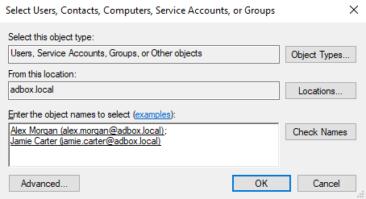

*Figure 5.11 - Group membership dialog showing multiple user accounts added and resolved during security group membership testing.*

One incorrect member was then removed from `GG_IT_Users` to confirm that group membership can be corrected through ADUC.

### Action

```text
Group Properties -> Members -> Select incorrect user -> Remove
```

Figure 5.12 shows the group membership after the incorrect member was removed.

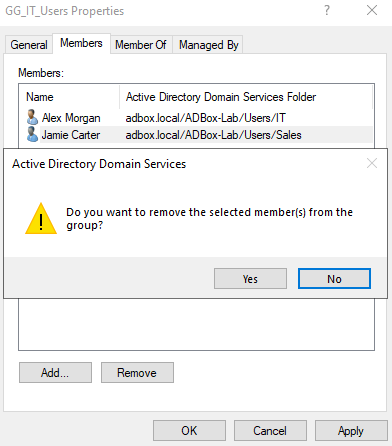

*Figure 5.12 - Group membership after removing the incorrect user, leaving the intended member in place.*

This is a common administration task: add users to a group, identify incorrect membership, remove the wrong user, and confirm the final state.

The ADUC Find tool was also used to validate the created security groups. Figure 5.13 shows the group search results.

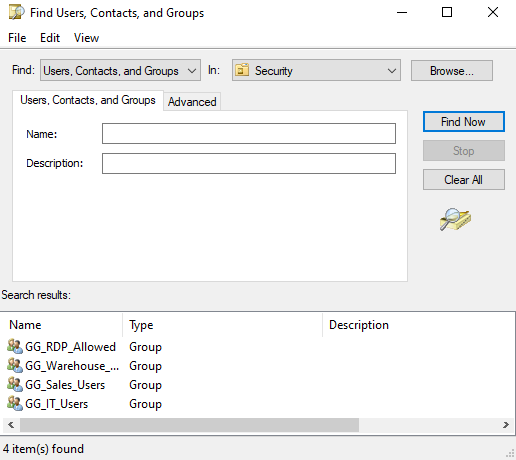

*Figure 5.13 - ADUC Find results showing the lab-created security groups available in Active Directory.*

## Result

The ADBox directory structure now separates users, computers, groups, and reserved service-account space inside a dedicated `ADBox-Lab` OU.

| Directory Area   | Result                                                                        |
| ---------------- | ----------------------------------------------------------------------------- |
| Workstations     | `AD-WIN10-01` and `AD-WIN10-02` moved into the `Workstations` OU.             |
| Department Users | IT, Sales, and Warehouse users created under separate OUs.                    |
| Security Groups  | Global Security groups created for department membership and RDP preparation. |
| Group Membership | Users added to their intended groups and incorrect membership corrected.      |
| Policy Readiness | Workstations are now placed where a workstation Group Policy can target them. |

This structure provides the foundation for applying Group Policy and testing access-control tasks in later stages.

## Navigation

| Previous                            | Current                | Next                                  |
| ----------------------------------- | ---------------------- | ------------------------------------- |
| [04 Domain Join](04-domain-join.md) | 05 Directory Structure | [06 Group Policy](06-group-policy.md) |
