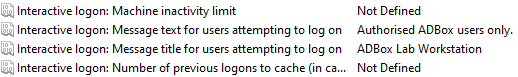
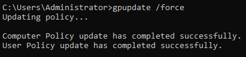
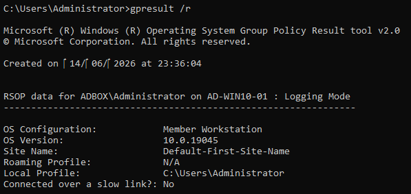
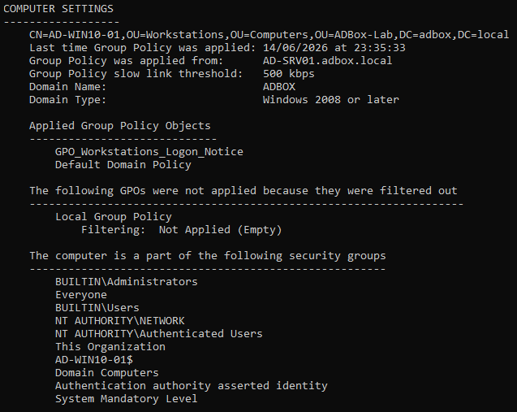
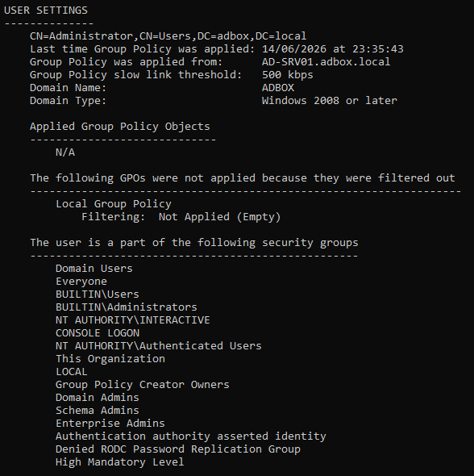
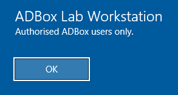

# Group Policy

Group Policy is the first central management test in ADBox: configure something once on the server, then prove the workstation receives it.

The visible result is a logon notice on `AD-WIN10-01`. The notice is simple on purpose. It proves that the workstation object is in the right OU, the GPO is linked correctly, policy refresh works, and the result can be checked from the client.

## Policy Target

The policy was targeted at the workstation OU created during the directory structure stage.

```text
ADBox-Lab → Computers → Workstations
```

This OU contains the joined Windows 10 clients:

```text
AD-WIN10-01
AD-WIN10-02
```

Linking the GPO to the `Workstations` OU means the setting applies to the computer objects inside that OU.

Group Policy targeting depends on where the GPO is linked and where the user or computer object is located. Since this test uses a computer-side setting, the important object is the workstation computer account, not the signed-in user account.

## GPO Purpose

A workstation logon notice was used as the first Group Policy test because it gives a clear client-side result.

Policy Area | Lab Choice
--- | ---
GPO Name | `GPO_Workstations_Logon_Notice`
Target OU | `ADBox-Lab → Computers → Workstations`
Policy Side | Computer Configuration
Visible Result | Logon Notice Shown Before Sign-In
Test Client | `AD-WIN10-01`

The goal was to prove that a setting configured on the Domain Controller could reach a domain-joined workstation.

## GPO Creation and Link

The GPO was created and linked to the Workstations OU.

> Open: Server Manager → Tools → Group Policy Management
> Shortcut: Win + R → `gpmc.msc`
> Path: Forest → Domains → adbox.local → ADBox-Lab → Computers → Workstations
> Action: Right-click Workstations → Create a GPO in this domain, and Link it here

The GPO was linked to the OU that contains the Windows 10 computer objects. This keeps the test focused on workstations instead of applying the setting to the whole domain.

## Policy Location

The logon notice setting sits under Security Options in Group Policy Management Editor.

> Open: Group Policy Management → Right-click `GPO_Workstations_Logon_Notice` → Edit
> Policy path: Computer Configuration → Policies → Windows Settings → Security Settings → Local Policies → Security Options

```text
Computer Configuration
→ Policies
→ Windows Settings
→ Security Settings
→ Local Policies
→ Security Options
```

The configured settings were:

```text
Interactive logon: Message title for users attempting to log on
```

```text
Interactive logon: Message text for users attempting to log on
```

Computer Configuration settings apply to the machine. User Configuration settings apply to the signed-in user. This distinction matters during troubleshooting because a policy can fail to appear if the setting is configured on the wrong side or linked to the wrong OU.

## Logon Notice Configuration

The GPO was configured with a short workstation logon notice.

Setting | Value
--- | ---
Message Title | `ADBox Lab Workstation`
Message Text | `Authorised ADBox users only.`



This confirms that the logon notice title and message text were set inside the GPO.

## Client Policy Update

On `AD-WIN10-01`, Group Policy was refreshed manually from Command Prompt.

> Open: Win + R → `cmd`
> Run on: `AD-WIN10-01`

```cmd
gpupdate /force
```



The command completed successfully for both Computer Policy and User Policy.

`gpupdate /force` tells the client to refresh policy immediately. This is useful in a lab because it avoids waiting for the normal background refresh interval before checking whether a new GPO applies.

## GPResult Summary

After the policy refresh, `gpresult /r` was used to review the policy result from the client side.

> Open: Win + R → `cmd`
> Run on: `AD-WIN10-01`

```cmd
gpresult /r
```



The summary confirmed the client and domain context.

Check | Result
--- | ---
User Context | `ADBOX\Administrator`
Client Computer | `AD-WIN10-01`
Operating System | Windows 10
Domain | `ADBOX`
Policy Source | `AD-SRV01.adbox.local`

This confirmed that the policy result was being generated on the domain-joined workstation and sourced from the ADBox Domain Controller.

## Computer Policy Validation

The computer policy section of `gpresult /r` showed that the workstation logon notice GPO was applied to `AD-WIN10-01`.



This is the main validation point for the stage because the logon notice is a Computer Configuration setting.

The result also confirmed that `AD-WIN10-01` was located under the expected workstation OU.

```text
ADBox-Lab → Computers → Workstations
```

This links the result back to the directory structure stage: the workstation object was moved into the OU that the GPO targets.

## User Policy Check

The user settings section of `gpresult /r` was also checked.



No user-side GPO was applied for this test. That was expected because the logon notice was configured as a computer-side policy.

This check is useful because it shows that Group Policy results need to be read in two parts: Computer Settings and User Settings. A missing user policy does not mean the computer policy failed.

## Workstation Result

After the policy refresh and validation checks, the configured logon notice appeared on the Windows 10 client.

> Open: Restart or sign out of `AD-WIN10-01`
> Check: Logon notice appears before sign-in.



This confirmed that the GPO reached the workstation and produced the expected visible result.

## Result

The workstation GPO was created, linked, applied, and validated from the client side.

Check | Outcome
--- | ---
GPO Linked To Workstations OU | Passed
Logon Notice Configured | Passed
Client Policy Refresh Completed | Passed
`gpresult /r` Generated On Client | Passed
Computer-Side GPO Applied | Passed
User-Side GPO Not Expected | Passed
Visible Logon Notice Displayed | Passed

This stage proves that `AD-SRV01` can centrally apply a workstation configuration to a domain-joined Windows 10 client through Group Policy.

## Navigation

Previous | Current | Next
--- | --- | ---
[05 Directory Structure](05-directory-structure.md) | Group Policy | [07 Remote Desktop](07-remote-desktop.md)
