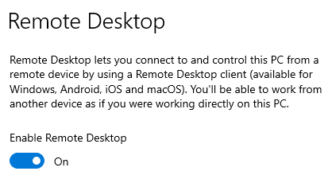
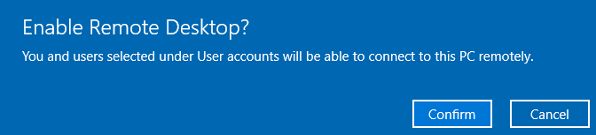
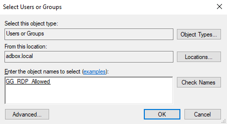
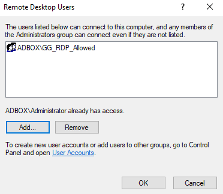
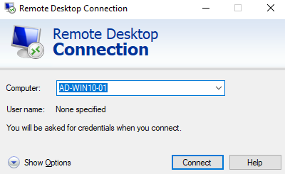
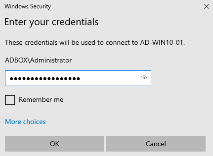
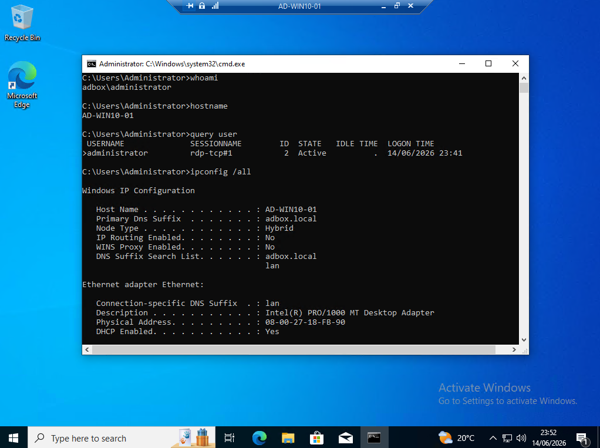

# Remote Desktop

Remote Desktop adds a practical support action to the lab: reaching a domain-joined workstation without sitting at its console.

This stage enables Remote Desktop Protocol (RDP) on `AD-WIN10-01`, adds an Active Directory (AD) group to the local Remote Desktop access list, connects from another Windows machine, and confirms the session from inside the remote workstation.

## RDP Target

The test target was `AD-WIN10-01`, one of the Windows 10 clients joined to `adbox.local`.

| Area            | Value                     |
| --------------- | ------------------------- |
| Target Computer | `AD-WIN10-01`             |
| Domain          | `adbox.local`             |
| NetBIOS Domain  | `ADBOX`                   |
| Access Group    | `GG_RDP_Allowed`          |
| Test Account    | `ADBOX\Administrator`     |
| Connection Tool | Remote Desktop Connection |

`GG_RDP_Allowed` was created during the directory structure stage as the access group for Remote Desktop testing.

The final connection used `ADBOX\Administrator`, which already has remote access by default. The group setup is still useful because it shows how Remote Desktop access can be prepared for normal domain users through group membership.

## Remote Desktop Enabled

Remote Desktop was enabled on `AD-WIN10-01` through Windows Settings.

### Work Path

```text
Start -> Settings -> System -> Remote Desktop
```

### Shortcut

```text
Win + R -> ms-settings:remotedesktop
```

### Action

```text
Turn on Remote Desktop.
```

Figure 7.1 shows Remote Desktop enabled on the Windows 10 client.



*Figure 7.1 - Windows 10 Remote Desktop settings showing Remote Desktop enabled on `AD-WIN10-01`.*

Windows displayed a confirmation prompt before enabling remote access, shown in Figure 7.2.



*Figure 7.2 - Windows confirmation prompt shown before enabling Remote Desktop access on `AD-WIN10-01`.*

This confirmed that the workstation was configured to accept Remote Desktop connections before the connection test was attempted.

RDP needs to be enabled on the target machine. Joining a workstation to the domain does not automatically make it accept remote desktop sessions.

## RDP Access Group

The `GG_RDP_Allowed` security group was selected as the access-control group for remote access.

### Work Path

```text
Settings -> System -> Remote Desktop -> Select users that can remotely access this PC
```

### Action

```text
Add ADBOX\GG_RDP_Allowed to the Remote Desktop Users list.
```

Figure 7.3 shows the domain security group selected for Remote Desktop access.



*Figure 7.3 - Select Users dialog showing `ADBOX\GG_RDP_Allowed` selected for Remote Desktop access.*

The group was then visible in the Remote Desktop Users list on `AD-WIN10-01`, shown in Figure 7.4.



*Figure 7.4 - Remote Desktop Users list showing `ADBOX\GG_RDP_Allowed` added to the workstation access list.*

This means members of `ADBOX\GG_RDP_Allowed` can be granted Remote Desktop access to the workstation.

Adding a domain group to the local Remote Desktop Users list connects AD group membership with local workstation access. A user can be managed centrally in AD, while the workstation controls which groups are allowed to connect remotely.

## Remote Desktop Connection

Remote Desktop Connection was opened from another Windows machine and pointed at the workstation hostname.

### Work Path

```text
Win + R -> mstsc
```

### Connection Target

```text
AD-WIN10-01
```

Figure 7.5 shows the Remote Desktop Connection target.



*Figure 7.5 - Remote Desktop Connection targeting `AD-WIN10-01` by hostname.*

Windows then requested credentials for the remote session.

### Credentials Used

```text
ADBOX\Administrator
```

Figure 7.6 shows the domain credentials entered for the RDP session.



*Figure 7.6 - Remote Desktop credentials prompt showing sign-in with the `ADBOX\Administrator` domain account.*

Using the hostname confirmed that the connection could reach the workstation by name inside the lab environment.

## Session Validation

After connection, Command Prompt was used inside the RDP session to confirm the account, workstation, session type, and domain network context.

### Work Path

```text
Inside RDP session -> Win + R -> cmd
```

### Run On

```text
Remote AD-WIN10-01 session
```

```cmd
whoami
hostname
query user
ipconfig /all
```

Figure 7.7 shows the session validation commands inside the remote workstation.



*Figure 7.7 - Command Prompt inside the RDP session showing the signed-in domain account, workstation hostname, `rdp-tcp` session, and network configuration.*

| Validation Check   | Confirmed Result                                               |
| ------------------ | -------------------------------------------------------------- |
| Signed-In Account  | `whoami` returned `adbox\administrator`.                       |
| Remote Workstation | `hostname` returned `AD-WIN10-01`.                             |
| Session Type       | `query user` showed an `rdp-tcp` session.                      |
| Domain Context     | `ipconfig /all` showed the workstation and domain DNS context. |

This confirmed that the connection reached the domain-joined workstation and opened an interactive Remote Desktop session.

`query user` is useful here because it shows the session name. An `rdp-tcp` session confirms that the user is connected through Remote Desktop.

## Session Behaviour

During testing, the VirtualBox console for `AD-WIN10-01` locked while the RDP session was active.

This was expected because Remote Desktop creates an interactive remote logon session. It does not behave like simple screen mirroring of the VirtualBox console.

The session was ended cleanly by signing out from inside Windows. Closing the RDP window disconnects the session, while signing out ends the remote user session properly.

## Evidence Note

This stage proves that RDP was enabled, the workstation accepted a remote connection, domain credentials were accepted, and the session could be validated from inside `AD-WIN10-01`.

The final connection used `ADBOX\Administrator`, which already has Remote Desktop access by default. A later normal-user test with a member of `GG_RDP_Allowed` would prove delegated group-based RDP access more directly.

## Result

Remote Desktop was enabled, the access group was added, and a remote session was opened successfully using domain credentials.

| Check                                      | Outcome |
| ------------------------------------------ | ------- |
| RDP enabled on `AD-WIN10-01`               | Passed  |
| Remote Desktop confirmation accepted       | Passed  |
| `GG_RDP_Allowed` added to local RDP access | Passed  |
| Connection opened to `AD-WIN10-01`         | Passed  |
| Domain credentials accepted                | Passed  |
| Remote session validated with commands     | Passed  |
| `rdp-tcp` session confirmed                | Passed  |

This stage proves that a domain-joined Windows workstation can be prepared for remote support and validated from inside the remote session.

## Navigation

| Previous                              | Current           | Next                                  |
| ------------------------------------- | ----------------- | ------------------------------------- |
| [06 Group Policy](06-group-policy.md) | 07 Remote Desktop | [08 File Sharing](08-file-sharing.md) |
