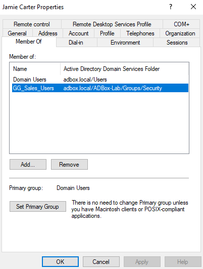
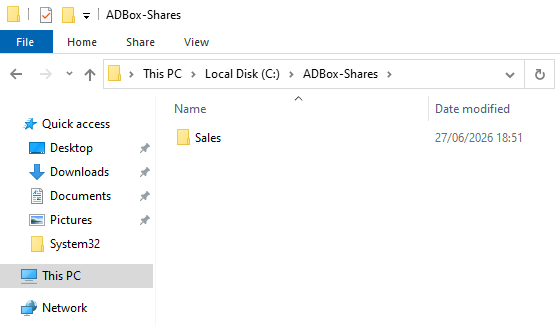
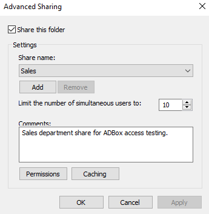
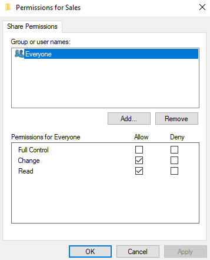
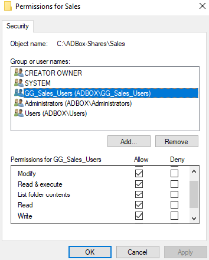
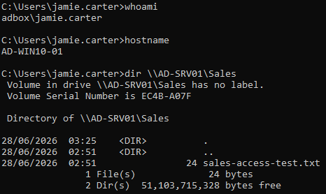
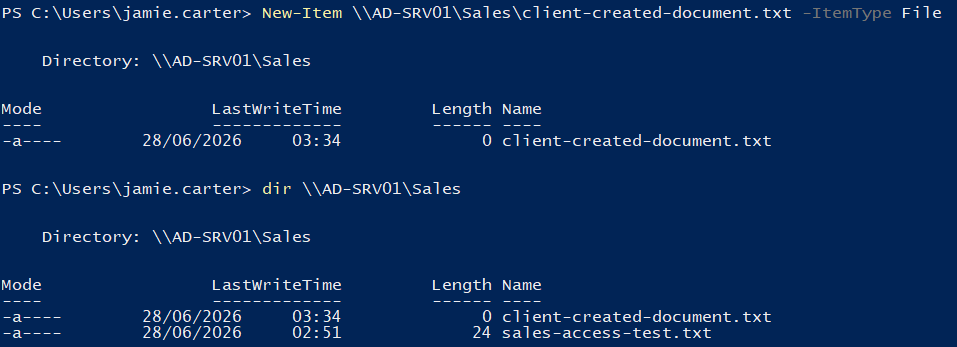

# File Sharing

File sharing is where the lab moves from directory objects into a normal support problem: can the right user access the right folder from a domain client?

This stage creates a Sales department share on `AD-SRV01`, applies group-based NTFS permissions, signs in as the Sales user on `AD-WIN10-01`, and confirms both read and write access.

## Share Target

The first share test uses the Sales department.

Area | Value
--- | ---
Server | `AD-SRV01`
Client | `AD-WIN10-01`
Share Name | `Sales`
Share Path | `\\AD-SRV01\Sales`
Local Folder | `C:\ADBox-Shares\Sales`
Security Group | `GG_Sales_Users`
Test User | Jamie Carter
Test Account | `ADBOX\jamie.carter`

The share is hosted on the server and tested from the client while signed in as the Sales user.

`\\AD-SRV01\Sales` is a UNC path. It points to a network share by using the server name and share name instead of a local drive path.

## Access Chain

The access model uses a simple chain from the user account to the shared folder.

```text
User Account -> Security Group -> Shared Folder -> Share Permissions -> NTFS Permissions -> Client Test
```

`Jamie Carter` is a member of `GG_Sales_Users`. The `Sales` folder is shared from `AD-SRV01`, and the Sales group is given folder access through NTFS permissions.

> Open: Server Manager → Tools → Active Directory Users and Computers
> Path: ADBox-Lab → Groups → Security → `GG_Sales_Users` → Members



## Folder Creation

A new folder was created on `AD-SRV01` for the Sales share.

> Open: File Explorer on `AD-SRV01`
> Path: `C:\ADBox-Shares\Sales`
> Action: Create the Sales folder and add a test file.

```text
C:\ADBox-Shares\Sales
```

A test file was added so the client could later prove that the share contents were visible.

```text
sales-access-test.txt
```



## Advanced Sharing

The `Sales` folder was shared using Advanced Sharing.

> Open: Right-click `C:\ADBox-Shares\Sales` → Properties → Sharing → Advanced Sharing
> Action: Tick Share this folder and set the share name to `Sales`.

Advanced Sharing was used because it exposes the share name, user limit, comment, and share permissions in one place.

Setting | Value
--- | ---
Share This Folder | Enabled
Share Name | `Sales`
User Limit | `10`
Comment | `Sales department share for ADBox access testing.`



The user limit controls how many network users can connect to the share at the same time. It does not decide who is allowed to access the folder.

## Share Permissions

Share permissions control access when the folder is reached through the network share path.

> Open: Folder Properties → Sharing → Advanced Sharing → Permissions
> Action: Set share-level permissions for `Everyone`.

```text
\\AD-SRV01\Sales
```

For this lab, `Everyone` was given `Change` and `Read` at the share permission layer.

Principal | Full Control | Change | Read
--- | --- | --- | ---
`Everyone` | No | Yes | Yes



`Full Control` was left unticked because it gives more access than needed for this department share test.

Share permissions and NTFS permissions work together. Windows checks both layers, and the effective access is limited by the most restrictive result.

## NTFS Permissions

NTFS permissions control access to the actual folder and files on disk.

> Open: Right-click `C:\ADBox-Shares\Sales` → Properties → Security → Edit → Add
> Action: Add `GG_Sales_Users` and assign Modify permission.

For the `Sales` folder, the Sales security group was given `Modify` access.

Principal | Permission
--- | ---
`GG_Sales_Users` | Modify
`Administrators` | Full Control
`SYSTEM` | Full Control



`Modify` was used because it allows normal department file work: read, create, edit, and delete. `Full Control` was not needed for the Sales group because department users do not need to change folder permissions or ownership.

In this lab, the share permission is broad enough to allow network access, while NTFS permissions decide which domain group can actually work with the folder.

## Client Sign-In

The access test was performed from `AD-WIN10-01` using the Sales user account.

> Open: Windows sign-in screen on `AD-WIN10-01`
> Action: Sign in as the Sales user.

```text
ADBOX\jamie.carter
```

Signing in as the department user confirms that access is being tested through the intended Active Directory account and group membership.

## Client Access Test

The share was tested from `AD-WIN10-01` using Command Prompt.

> Open: Win + R → `cmd`
> Run on: `AD-WIN10-01` while signed in as `ADBOX\jamie.carter`

```cmd
whoami
hostname
dir \\AD-SRV01\Sales
```



Validation Check | Confirmed Result
--- | ---
Signed-In Account | `whoami` returned `adbox\jamie.carter`.
Client Workstation | `hostname` returned `AD-WIN10-01`.
Share Listing | `dir \\AD-SRV01\Sales` listed the Sales share contents.

This confirmed that the Sales user could reach and list the shared folder from the domain-joined client.

## Client Write Test

A file was then created in the shared folder from the client using PowerShell.

> Open: PowerShell on `AD-WIN10-01`
> Run as: `ADBOX\jamie.carter`

```powershell
New-Item \\AD-SRV01\Sales\client-created-document.txt -ItemType File
dir \\AD-SRV01\Sales
```



The output confirmed that the Sales user could create a file inside the share and then list it from the client.

This proves that the user had more than read-only access. The `Modify` permission allowed the normal department file action being tested.

## Result

The Sales department share was created, secured with group-based NTFS permissions, and tested from a domain-joined Windows 10 client.

Check | Outcome
--- | ---
Sales Folder Created On `AD-SRV01` | Passed
Folder Shared As `Sales` | Passed
Share Permissions Configured | Passed
`GG_Sales_Users` Added To NTFS Permissions | Passed
Jamie Carter Confirmed In `GG_Sales_Users` | Passed
Jamie Carter Signed In On `AD-WIN10-01` | Passed
Client Listed Share Contents | Passed
Client Created File In Share | Passed

This stage proves that Active Directory group membership can be used to control access to a shared folder in the lab domain.

## Navigation

Previous | Current | Next
--- | --- | ---
[07 Remote Desktop](07-remote-desktop.md) | File Sharing | [09 Account Recovery](09-account-recovery.md)
