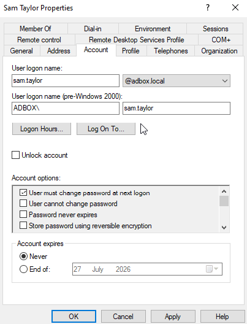
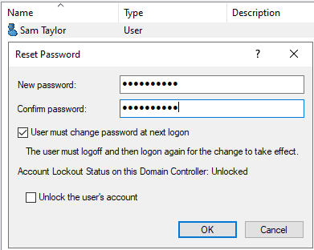
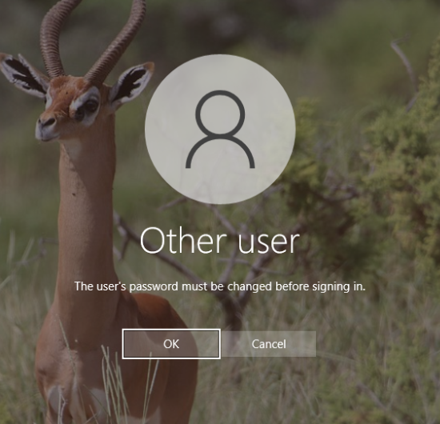
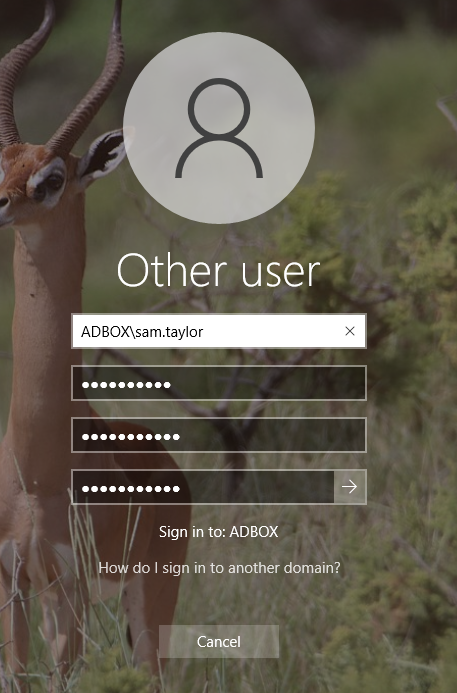
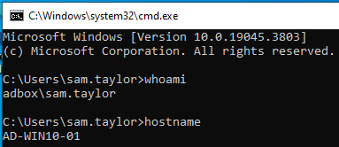
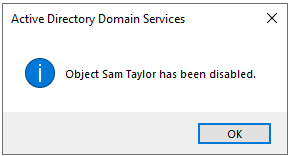
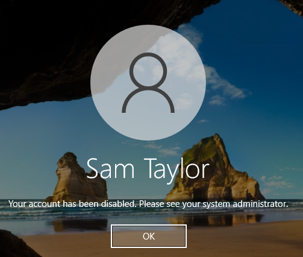
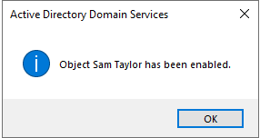
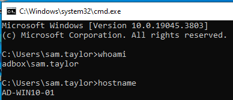

# Account Recovery

This stage tested a basic Active Directory account recovery workflow using `Sam Taylor`, a Warehouse user account.

The purpose was to practise common support actions: resetting a user password, forcing a password change at next sign-in, confirming successful login, disabling the account, confirming access is blocked, and enabling the account again.

| Item          | Value                                |
| ------------- | ------------------------------------ |
| Domain        | `adbox.local`                        |
| User          | `Sam Taylor`                         |
| Account       | `ADBOX\sam.taylor`                   |
| User Location | `ADBox-Lab > Users > Warehouse`      |
| Client        | `AD-WIN10-01`                        |
| Admin System  | `AD-SRV01`                           |
| Tool          | Active Directory Users and Computers |

## Recovery Workflow

The account recovery process followed a simple support flow.

```text id="rozd5s"
Password Reset -> Forced Password Change -> User Sign-In Confirmed -> Account Disabled -> Sign-In Blocked -> Account Enabled -> Sign-In Restored
```

This keeps the evidence focused on the technical Active Directory actions. Ticket logging and user-facing troubleshooting notes can be handled separately in the N3 service desk lab.

## Account State Before Reset

The starting point was checked in Active Directory Users and Computers (ADUC).

The account tab showed the logon name for `sam.taylor` and confirmed that the account existed in the domain before recovery actions were applied.



## Password Reset

The password was reset from ADUC using the `Reset Password` action.

The reset used a temporary password and kept `User must change password at next logon` enabled. This matches a common support workflow where an administrator sets a temporary password and the user creates their own password at sign-in.

The account was not locked, so `Unlock the user's account` was left unticked.

| Setting                                 | Value                |
| --------------------------------------- | -------------------- |
| Temporary Password                      | Set by administrator |
| User Must Change Password At Next Logon | Enabled              |
| Unlock User Account                     | Not selected         |
| Account Lockout Status                  | Unlocked             |



## Password Change Required

On `AD-WIN10-01`, the user attempted to sign in as:

```text id="q301b8"
ADBOX\sam.taylor
```

Windows required the password to be changed before the user could complete sign-in. This confirmed that the `User must change password at next logon` setting was active.



## Client Password Update

The password was then updated from the Windows sign-in screen.

This proves the user-side part of the recovery flow: the temporary password was accepted, but Windows required the user to replace it before allowing access to the desktop.



## Post-Change Sign-In

After the password change, Sam Taylor signed in successfully on `AD-WIN10-01`.

The session was validated with Command Prompt.

```cmd id="qtxm7w"
whoami
hostname
```

Expected identity:

```text id="7a54x5"
adbox\sam.taylor
AD-WIN10-01
```



## Account Disabled

The account was then disabled in ADUC.

Disabling an account keeps the object in Active Directory but blocks new sign-ins. This is useful when access needs to be stopped without deleting the user account or losing its group membership, profile history, or administrative record.



## Disabled Account Notification

After the account was disabled, sign-in was tested again from `AD-WIN10-01`.

Windows blocked the login and showed that the account had been disabled. This confirmed that the domain account state was being enforced at sign-in.



## Account Enabled Again

The account was enabled again in ADUC.

This restored the account for normal authentication.



## Access Restored

After the account was enabled again, Sam Taylor signed in successfully on `AD-WIN10-01`.

The restored session was validated with Command Prompt.

```cmd id="ny5tmp"
whoami
hostname
```

Expected identity:

```text id="uzp474"
adbox\sam.taylor
AD-WIN10-01
```



## Validation Summary

| Check                                          | Result |
| ---------------------------------------------- | ------ |
| Sam Taylor account reviewed before reset       | Passed |
| Password reset completed in ADUC               | Passed |
| Forced password change enabled                 | Passed |
| Client required password change before sign-in | Passed |
| User completed password change                 | Passed |
| Sign-in confirmed as `ADBOX\sam.taylor`        | Passed |
| Account disabled in ADUC                       | Passed |
| Disabled account blocked from signing in       | Passed |
| Account enabled again in ADUC                  | Passed |
| Sign-in restored as `ADBOX\sam.taylor`         | Passed |

## Support Notes

Password reset and account enablement are common support tasks in a Windows domain.

A password reset allows an administrator to set a temporary password for a user. Enabling `User must change password at next logon` forces the user to replace that temporary password before accessing the desktop.

Disabling an account blocks new sign-ins while keeping the account object in Active Directory. This is useful when access needs to be removed while preserving the account record, group membership, and administrative history.

The final sign-in test confirms that the account was restored successfully and that the user could authenticate again on a domain-joined Windows client.
