# PowerShell Administration

PowerShell Administration closes the lab by reviewing the same environment from the command line alongside the graphical tools used earlier.

The commands are deliberately short. They are support-style checks for users, account state, group membership, computer objects, DNS resolution, client reachability, share access, and a basic CSV export.

## Review Target

The commands were run from the Domain Controller and focused on the users, computers, DNS records, clients, and shared folder created earlier in the lab.

| Area          | Value                                    |
| ------------- | ---------------------------------------- |
| Server        | `AD-SRV01`                               |
| Domain        | `adbox.local`                            |
| Shell         | Windows PowerShell                       |
| Module        | Active Directory                         |
| Client Checks | `AD-WIN10-01`, `AD-WIN10-02`             |
| Share Checked | `\\AD-SRV01\Sales`                       |
| Report Path   | `C:\ADBox-Shares\adbox-users-report.csv` |

## Review Steps

The PowerShell review followed the same order as a basic support check: confirm the tools are available, check directory objects, test name resolution and connectivity, then export a simple report.

| Step | Action                   | Covers                                                             |
| ---- | ------------------------ | ------------------------------------------------------------------ |
| 01   | Load AD Module           | Confirm Active Directory PowerShell commands are available.        |
| 02   | List Lab Users           | Query ADBox user accounts from the lab Users OU.                   |
| 03   | Check User Details       | Review Sam Taylor account status after account recovery.           |
| 04   | Check Group Membership   | Confirm Sam Taylor belongs to the expected groups.                 |
| 05   | List Domain Computers    | Review server and workstation computer objects.                    |
| 06   | Check Disabled Users     | Search the lab Users OU for disabled accounts.                     |
| 07   | Test DNS Resolution      | Confirm `adbox.local` resolves to the lab server.                  |
| 08   | Test Client Connectivity | Confirm both Windows 10 clients respond from `AD-SRV01`.           |
| 09   | Check Share Path         | Confirm the Sales share exists and can be listed.                  |
| 10   | Export User Report       | Create a CSV report of lab users.                                  |
| 11   | Validate User Report     | Confirm the exported CSV exists and contains the expected records. |

## Active Directory Module

The Active Directory module was imported on `AD-SRV01`.

### Work Path

```text
AD-SRV01 -> Start -> Windows PowerShell
```

### Run On

```text
AD-SRV01
```

```powershell
Import-Module ActiveDirectory

Get-Command -Module ActiveDirectory | Select-Object -First 10
```

### Command Breakdown

| Part                            | Purpose                                                                |
| ------------------------------- | ---------------------------------------------------------------------- |
| `Import-Module ActiveDirectory` | Loads the Active Directory PowerShell module into the current session. |
| `Get-Command`                   | Lists commands available to PowerShell.                                |
| `-Module ActiveDirectory`       | Limits the command list to Active Directory commands.                  |
| Pipeline to `Select-Object`     | Sends the command list into the next command.                          |
| `Select-Object -First 10`       | Shows only the first 10 commands so the output stays readable.         |

Figure 10.1 shows the Active Directory module loaded and AD commands listed.

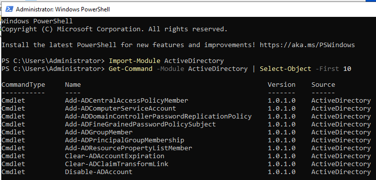

*Figure 10.1 - Windows PowerShell on `AD-SRV01` showing the Active Directory module imported and AD PowerShell commands available.*

The Active Directory module provides commands such as `Get-ADUser`, `Get-ADComputer`, and `Search-ADAccount`. These are useful when the same checks need to be repeated or exported.

## ADBox User List

The ADBox lab users were queried from the lab Users OU.

### Run On

```text
AD-SRV01 PowerShell
```

```powershell
Get-ADUser -Filter * -SearchBase "OU=Users,OU=ADBox-Lab,DC=adbox,DC=local" |
Select-Object Name, SamAccountName, Enabled
```

### Command Breakdown

| Part                                                    | Purpose                                                    |
| ------------------------------------------------------- | ---------------------------------------------------------- |
| `Get-ADUser`                                            | Queries Active Directory user accounts.                    |
| `-Filter *`                                             | Returns all users that match the selected search location. |
| `-SearchBase "OU=Users,OU=ADBox-Lab,DC=adbox,DC=local"` | Limits the search to the ADBox lab Users OU.               |
| Pipeline to `Select-Object`                             | Passes the user objects into the output selection command. |
| `Select-Object Name, SamAccountName, Enabled`           | Shows only the fields needed for this check.               |

Figure 10.2 shows the lab users returned from the ADBox Users OU.

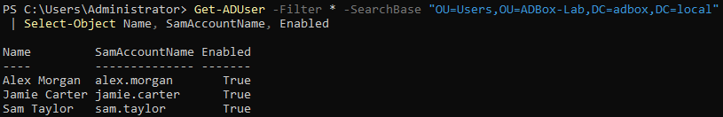

*Figure 10.2 - PowerShell output showing the lab-created user accounts and their enabled status.*

| User         | Account        | Enabled |
| ------------ | -------------- | ------- |
| Alex Morgan  | `alex.morgan`  | True    |
| Jamie Carter | `jamie.carter` | True    |
| Sam Taylor   | `sam.taylor`   | True    |

A search base keeps the command focused on the lab OU, so the output does not include unrelated built-in domain accounts.

## User Account Details

Sam Taylor was checked directly to review account status after the account recovery stage.

### Run On

```text
AD-SRV01 PowerShell
```

```powershell
Get-ADUser sam.taylor -Properties Enabled, PasswordLastSet, PasswordExpired, CannotChangePassword |
Select-Object Name, SamAccountName, Enabled, PasswordLastSet, PasswordExpired, CannotChangePassword
```

### Command Breakdown

| Part                                                                          | Purpose                                                               |
| ----------------------------------------------------------------------------- | --------------------------------------------------------------------- |
| `Get-ADUser sam.taylor`                                                       | Queries the Sam Taylor user account by logon name.                    |
| `-Properties Enabled, PasswordLastSet, PasswordExpired, CannotChangePassword` | Requests extra account properties useful for account recovery checks. |
| `PasswordLastSet`                                                             | Shows when the password was last set or changed.                      |
| `PasswordExpired`                                                             | Shows whether the password is currently expired.                      |
| `CannotChangePassword`                                                        | Shows whether the user is blocked from changing their own password.   |
| Pipeline to `Select-Object`                                                   | Passes the account object into the output selection command.          |
| `Select-Object ...`                                                           | Displays only the account fields relevant to this check.              |

Figure 10.3 shows Sam Taylor’s account details after the recovery stage.

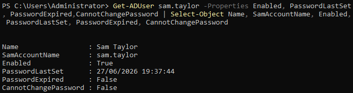

*Figure 10.3 - PowerShell output showing `sam.taylor` enabled, with password state fields returned for review.*

The output confirmed that the account was enabled, the password had been set, the password was not expired, and the user was allowed to change their password.

## User Group Membership

Sam Taylor’s group membership was checked from PowerShell.

### Run On

```text
AD-SRV01 PowerShell
```

```powershell
Get-ADPrincipalGroupMembership sam.taylor |
Select-Object Name, GroupCategory, GroupScope
```

### Command Breakdown

| Part                                        | Purpose                                                                |
| ------------------------------------------- | ---------------------------------------------------------------------- |
| `Get-ADPrincipalGroupMembership sam.taylor` | Lists the Active Directory groups that Sam Taylor belongs to.          |
| Pipeline to `Select-Object`                 | Passes the group membership objects into the output selection command. |
| `Name`                                      | Shows the group name.                                                  |
| `GroupCategory`                             | Shows whether the group is a Security group or Distribution group.     |
| `GroupScope`                                | Shows whether the group is Global, Domain Local, or Universal.         |

Figure 10.4 shows Sam Taylor’s group membership.

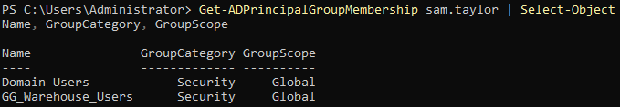

*Figure 10.4 - PowerShell output showing `sam.taylor` as a member of `Domain Users` and `GG_Warehouse_Users`.*

| Group              | Category | Scope  |
| ------------------ | -------- | ------ |
| Domain Users       | Security | Global |
| GG_Warehouse_Users | Security | Global |

This confirms that the Warehouse user is in the expected department group.

## Domain Computer Objects

The domain computer objects were listed from Active Directory.

### Run On

```text
AD-SRV01 PowerShell
```

```powershell
Get-ADComputer -Filter * |
Select-Object Name, Enabled, DistinguishedName
```

### Command Breakdown

| Part                        | Purpose                                                        |
| --------------------------- | -------------------------------------------------------------- |
| `Get-ADComputer`            | Queries computer objects in Active Directory.                  |
| `-Filter *`                 | Returns all computer objects in the domain.                    |
| Pipeline to `Select-Object` | Passes the computer objects into the output selection command. |
| `Name`                      | Shows the computer name.                                       |
| `Enabled`                   | Shows whether the computer account is enabled.                 |
| `DistinguishedName`         | Shows where the computer object sits inside Active Directory.  |

Figure 10.5 shows the Domain Controller and both Windows 10 clients as AD computer objects.

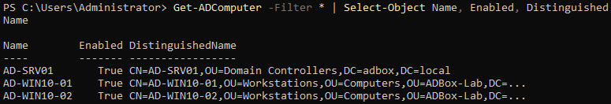

*Figure 10.5 - PowerShell output showing `AD-SRV01`, `AD-WIN10-01`, and `AD-WIN10-02` as enabled computer objects in Active Directory.*

| Computer      | Purpose                         |
| ------------- | ------------------------------- |
| `AD-SRV01`    | Domain Controller               |
| `AD-WIN10-01` | Domain-joined Windows 10 client |
| `AD-WIN10-02` | Domain-joined Windows 10 client |

A computer object is the Active Directory record for a domain-joined machine. It lets the domain recognise and manage that device.

## Disabled Lab User Check

Disabled user accounts were checked inside the ADBox lab Users OU.

### Run On

```text
AD-SRV01 PowerShell
```

```powershell
$disabledLabUsers = Search-ADAccount -AccountDisabled -UsersOnly -SearchBase "OU=Users,OU=ADBox-Lab,DC=adbox,DC=local"

$disabledLabUsers |
Select-Object Name, SamAccountName, Enabled

"Disabled ADBox lab users: $($disabledLabUsers.Count)"
```

### Command Breakdown

| Part                                                    | Purpose                                                                |
| ------------------------------------------------------- | ---------------------------------------------------------------------- |
| `$disabledLabUsers = ...`                               | Stores the command result in a variable so it can be reused.           |
| `Search-ADAccount`                                      | Searches Active Directory accounts by account condition.               |
| `-AccountDisabled`                                      | Searches for disabled accounts.                                        |
| `-UsersOnly`                                            | Limits the result to user accounts.                                    |
| `-SearchBase "OU=Users,OU=ADBox-Lab,DC=adbox,DC=local"` | Limits the search to the ADBox lab Users OU.                           |
| Pipeline to `Select-Object`                             | Passes the disabled account results into the output selection command. |
| `Select-Object Name, SamAccountName, Enabled`           | Shows the account name, logon name, and enabled state.                 |
| `$disabledLabUsers.Count`                               | Counts how many disabled lab users were found.                         |

Figure 10.6 shows the disabled user check scoped to the ADBox lab Users OU.

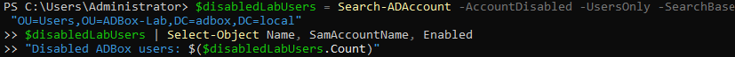

*Figure 10.6 - PowerShell output showing the disabled-account check for the ADBox lab Users OU.*

The check was scoped to the ADBox lab Users OU so the result focused on lab-created accounts and excluded built-in domain accounts such as `Guest` and `krbtgt`.

## DNS Resolution Check

DNS resolution was checked for the lab domain.

### Run On

```text
AD-SRV01 PowerShell
```

```powershell
Resolve-DnsName adbox.local -Type A
```

### Command Breakdown

| Part              | Purpose                             |
| ----------------- | ----------------------------------- |
| `Resolve-DnsName` | Performs a DNS lookup.              |
| `adbox.local`     | Sets the domain name being checked. |
| `-Type A`         | Requests the IPv4 address record.   |

Figure 10.7 shows `adbox.local` resolving to the lab server address.

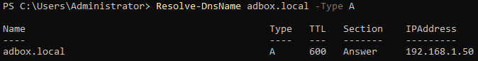

*Figure 10.7 - PowerShell output showing `adbox.local` resolving to `192.168.1.50`.*

An A record maps a name to an IPv4 address. In this lab, `adbox.local` resolving to `192.168.1.50` confirms that the domain name points back to `AD-SRV01`.

## Client Connectivity Check

Connectivity from `AD-SRV01` to both domain clients was tested with `Test-Connection`.

### Run On

```text
AD-SRV01 PowerShell
```

```powershell
Test-Connection AD-WIN10-01 -Count 2

Test-Connection AD-WIN10-02 -Count 2
```

### Command Breakdown

| Part              | Purpose                                                    |
| ----------------- | ---------------------------------------------------------- |
| `Test-Connection` | Sends network test packets to a target, similar to `ping`. |
| `AD-WIN10-01`     | First domain-joined Windows 10 client.                     |
| `AD-WIN10-02`     | Second domain-joined Windows 10 client.                    |
| `-Count 2`        | Sends two test packets so the output stays short.          |

Figure 10.8 shows both clients responding to connectivity tests from the server.

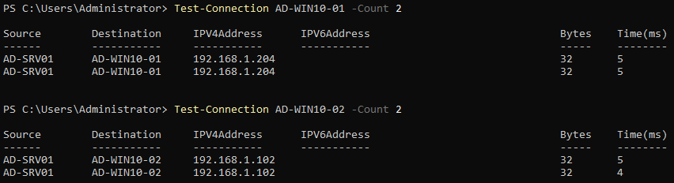

*Figure 10.8 - PowerShell output showing successful `Test-Connection` results from `AD-SRV01` to both Windows 10 clients.*

| Client        | IPv4 Address    |
| ------------- | --------------- |
| `AD-WIN10-01` | `192.168.1.204` |
| `AD-WIN10-02` | `192.168.1.102` |

This confirmed that both domain-joined clients were reachable from the server side.

## Share Path Check

The Sales share from the file sharing stage was checked from PowerShell.

### Run On

```text
AD-SRV01 PowerShell
```

```powershell
Test-Path "\\AD-SRV01\Sales"

Get-ChildItem "\\AD-SRV01\Sales"
```

### Command Breakdown

| Part                               | Purpose                                                        |
| ---------------------------------- | -------------------------------------------------------------- |
| `Test-Path "\\AD-SRV01\Sales"`     | Checks whether the network share path exists and is reachable. |
| `Get-ChildItem "\\AD-SRV01\Sales"` | Lists the files and folders inside the share.                  |
| `\\AD-SRV01\Sales`                 | Universal Naming Convention path to the Sales share.           |

Figure 10.9 shows the Sales share path check and file listing.

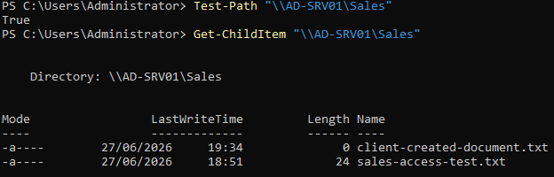

*Figure 10.9 - PowerShell output showing `Test-Path` returning `True` and listing the contents of `\\AD-SRV01\Sales`.*

| File                          | Purpose                                             |
| ----------------------------- | --------------------------------------------------- |
| `sales-access-test.txt`       | Original file created during share setup.           |
| `client-created-document.txt` | File created from the client during access testing. |

A Universal Naming Convention (UNC) path starts with the server name and share name, such as `\\AD-SRV01\Sales`. This is the normal Windows format for accessing a shared folder over the network.

## User Report Export

A basic user report was exported from the ADBox lab Users OU.

### Run On

```text
AD-SRV01 PowerShell
```

```powershell
Get-ADUser -Filter * -SearchBase "OU=Users,OU=ADBox-Lab,DC=adbox,DC=local" |
Select-Object Name, SamAccountName, Enabled |
Export-Csv "C:\ADBox-Shares\adbox-users-report.csv" -NoTypeInformation
```

### Command Breakdown

| Part                                                    | Purpose                                                        |
| ------------------------------------------------------- | -------------------------------------------------------------- |
| `Get-ADUser -Filter *`                                  | Gets all user accounts from the selected search location.      |
| `-SearchBase "OU=Users,OU=ADBox-Lab,DC=adbox,DC=local"` | Limits the export to the ADBox lab Users OU.                   |
| Pipeline to `Select-Object`                             | Passes the user objects into the output selection command.     |
| `Select-Object Name, SamAccountName, Enabled`           | Keeps only the fields needed for the report.                   |
| Pipeline to `Export-Csv`                                | Sends the selected fields into the CSV export command.         |
| `Export-Csv`                                            | Writes the selected output to a CSV file.                      |
| `C:\ADBox-Shares\adbox-users-report.csv`                | Sets the destination path for the report file.                 |
| `-NoTypeInformation`                                    | Removes PowerShell type metadata from the top of the CSV file. |

Figure 10.10 shows the CSV export command.

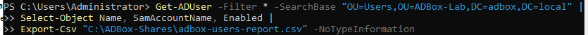

*Figure 10.10 - PowerShell command exporting ADBox lab user account details to `adbox-users-report.csv`.*

This created a CSV report containing the lab user names, logon names, and enabled status.

A pipeline passes output from one command into the next command. Here, user objects are queried, selected fields are chosen, and the final result is written to a CSV file.

## User Report Validation

The exported CSV file was then checked from PowerShell.

### Run On

```text
AD-SRV01 PowerShell
```

```powershell
Get-ChildItem "C:\ADBox-Shares\adbox-users-report.csv"

Get-Content "C:\ADBox-Shares\adbox-users-report.csv"
```

### Command Breakdown

| Part                                                     | Purpose                                                |
| -------------------------------------------------------- | ------------------------------------------------------ |
| `Get-ChildItem "C:\ADBox-Shares\adbox-users-report.csv"` | Confirms that the CSV report file exists.              |
| `Get-Content "C:\ADBox-Shares\adbox-users-report.csv"`   | Displays the contents of the CSV report in PowerShell. |

Figure 10.11 shows the report file and its contents.

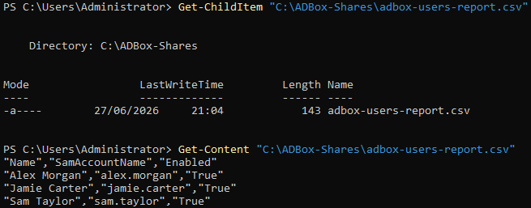

*Figure 10.11 - PowerShell output confirming the CSV report exists and contains the expected ADBox lab users.*

| Name         | SamAccountName | Enabled |
| ------------ | -------------- | ------- |
| Alex Morgan  | `alex.morgan`  | True    |
| Jamie Carter | `jamie.carter` | True    |
| Sam Taylor   | `sam.taylor`   | True    |

## Validation Summary

| Check                                        | Result |
| -------------------------------------------- | ------ |
| Active Directory PowerShell module imported  | Passed |
| Active Directory commands listed             | Passed |
| ADBox lab users queried                      | Passed |
| Sam Taylor account details checked           | Passed |
| Sam Taylor group membership checked          | Passed |
| Domain computer objects listed               | Passed |
| Disabled lab users checked                   | Passed |
| `adbox.local` resolved through DNS           | Passed |
| `AD-WIN10-01` responded to connectivity test | Passed |
| `AD-WIN10-02` responded to connectivity test | Passed |
| `\\AD-SRV01\Sales` path checked              | Passed |
| Share contents listed                        | Passed |
| ADBox user report exported to CSV            | Passed |
| CSV report validated from PowerShell         | Passed |

## Result

PowerShell was used to check the same lab environment that was built through the earlier graphical stages.

| Outcome             | Meaning                                                                             |
| ------------------- | ----------------------------------------------------------------------------------- |
| AD Review           | Users, groups, computers, and account state could be checked from the command line. |
| DNS Review          | The lab domain resolved to the Domain Controller address.                           |
| Connectivity Review | Both Windows 10 clients responded from the server side.                             |
| Share Review        | The Sales share existed and contained the expected test files.                      |
| Report Export       | Lab user account details were exported and validated as a CSV file.                 |

This stage confirms that the ADBox environment can be reviewed from PowerShell, which is useful for repeatable checks, troubleshooting, and handover evidence.

## Navigation

| Previous                                      | Current                      | Next                           |
| --------------------------------------------- | ---------------------------- | ------------------------------ |
| [09 Account Recovery](09-account-recovery.md) | 10 PowerShell Administration | [Project README](../README.md) |
