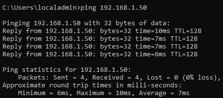
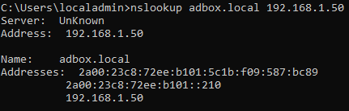
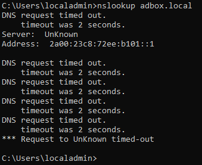
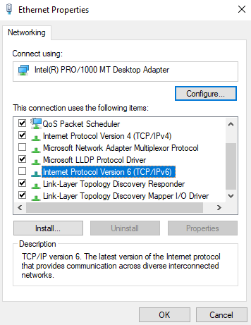
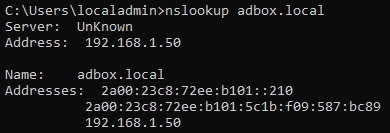

# DNS IPv6 Conflict

This troubleshooting record covers a DNS issue found during Windows 10 client validation.

The clients could reach `AD-SRV01` by Internet Protocol version 4 (IPv4) address, and direct DNS queries to the server worked. The failure appeared only when the client used its default DNS lookup path. The issue was traced to router-provided Internet Protocol version 6 (IPv6) DNS information taking the client away from the intended lab DNS path.

## Issue Summary

| Area              | Value                                        |
| ----------------- | -------------------------------------------- |
| Affected Clients  | Windows 10 lab clients                       |
| Domain            | `adbox.local`                                |
| Domain Controller | `AD-SRV01`                                   |
| DC IPv4 Address   | `192.168.1.50`                               |
| Symptom           | `nslookup adbox.local` timed out             |
| Working Check     | `nslookup adbox.local 192.168.1.50`          |
| Root Cause        | Client using router-provided IPv6 DNS path   |
| Resolution        | IPv6 disabled on the Windows 10 lab adapters |

## Discovery

During client validation, the Windows 10 lab clients could reach `AD-SRV01` by IPv4 address.

```cmd
ping 192.168.1.50
```

Figure T1.1 shows the client successfully reaching the Domain Controller (DC) by IPv4 address.



*Figure T1.1 - Windows 10 client successfully pinging `AD-SRV01` at `192.168.1.50`, confirming basic client-to-server connectivity.*

A direct Domain Name System (DNS) query to `192.168.1.50` also resolved `adbox.local`.

```cmd
nslookup adbox.local 192.168.1.50
```

Figure T1.2 shows the successful direct lookup.



*Figure T1.2 - Direct `nslookup` query to `192.168.1.50` resolving `adbox.local`, confirming that DNS worked when the client queried `AD-SRV01` directly.*

This confirmed two important points:

| Check                   | Result |
| ----------------------- | ------ |
| Client can reach DC     | Passed |
| DNS works on `AD-SRV01` | Passed |
| Direct DNS query works  | Passed |

The issue appeared when the client used a standard lookup without specifying the DNS server.

```cmd
nslookup adbox.local
```

Figure T1.3 shows the timeout from the default lookup path.



*Figure T1.3 - Standard `nslookup adbox.local` timing out, showing that the client default DNS path was not using the intended lab DNS route.*

This showed that the issue was not basic connectivity or a failed DNS service. The problem was the DNS path the client chose by default.

## Diagnosis

The client adapter configuration was reviewed after the timeout. The IPv4 DNS setting was already pointing to the lab DNS server:

```text
192.168.1.50
```

The issue was isolated by comparing direct and default DNS lookup behaviour.

| Command                             | Result | Meaning                                                  |
| ----------------------------------- | ------ | -------------------------------------------------------- |
| `nslookup adbox.local 192.168.1.50` | Worked | DNS worked when the client queried `AD-SRV01` directly.  |
| `nslookup adbox.local`              | Failed | The default client DNS path was using a different route. |

The Windows 10 clients were still receiving router-provided IPv6 DNS information. That meant the client could avoid the intended IPv4 DNS route even though the IPv4 DNS field had been configured correctly.

For this lab, DNS needed to stay on the controlled IPv4 path:

```text
Client -> 192.168.1.50 -> AD-SRV01 DNS -> adbox.local
```

## Action Taken

IPv6 was disabled on the Windows 10 lab adapter to keep DNS resolution controlled through the IPv4-based Active Directory lab path.

### Work Path

```text
Win + R -> ncpa.cpl -> Network Connections -> Ethernet -> Properties
```

### Action

```text
Untick Internet Protocol Version 6 (TCP/IPv6) on the Windows 10 lab adapter.
```

Figure T1.4 shows the client adapter after IPv6 was disabled.



*Figure T1.4 - Windows 10 adapter properties with IPv6 unticked so lab DNS lookups stay on the intended IPv4 path through `AD-SRV01`.*

This was a lab-specific control decision. The change was applied only to the Windows 10 lab adapters used for ADBox.

## Resolution

After IPv6 was disabled on the lab adapter, the standard lookup worked.

```cmd
nslookup adbox.local
```

Figure T1.5 shows the successful lookup using the default query format.



*Figure T1.5 - Standard `nslookup adbox.local` resolving successfully after the client DNS path was kept on the intended IPv4 route.*

The issue was resolved by keeping the lab client on the intended IPv4 DNS path for `adbox.local`.

## Validation Summary

| Check                                       | Result          |
| ------------------------------------------- | --------------- |
| Client could ping `AD-SRV01` by IPv4        | Passed          |
| Direct DNS query to `192.168.1.50` worked   | Passed          |
| Default `nslookup adbox.local` timed out    | Confirmed issue |
| IPv6 was disabled on the lab client adapter | Completed       |
| Default `nslookup adbox.local` worked       | Passed          |
| Client used intended lab DNS path           | Passed          |

## Support Notes

This was a DNS path issue, not a failed Domain Controller or broken network link.

The useful troubleshooting lesson is the difference between direct and default DNS queries. A direct query proves whether a specific DNS server can answer. A default query proves which DNS route the client is actually using.

In this case, the direct query to `AD-SRV01` worked, but the default query failed. That pointed to client DNS path selection, which led to the router-provided IPv6 DNS behaviour.
