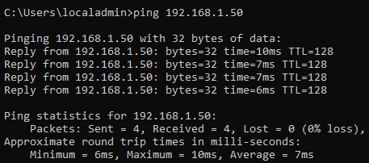
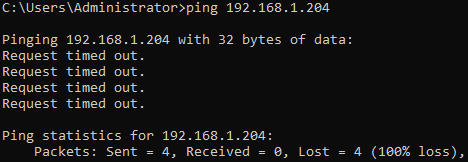
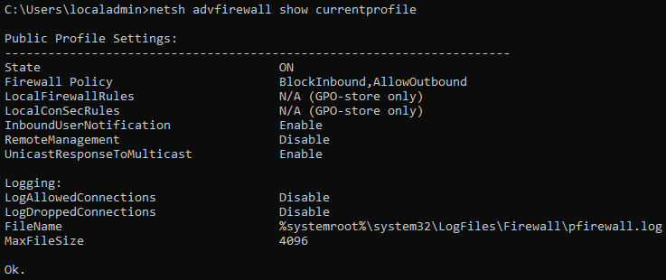
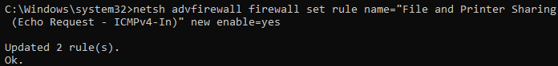
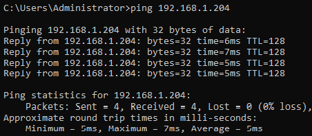

# Client Firewall Ping

This troubleshooting record covers a one-way ping issue found during ADBox connectivity testing.

The Windows 10 client could ping `AD-SRV01`, but `AD-SRV01` could not ping the client. The issue was traced to the Windows Firewall profile on the client blocking inbound Internet Control Message Protocol version 4 (ICMPv4) echo requests.

## Issue Summary

| Area              | Value                                                 |
| ----------------- | ----------------------------------------------------- |
| Client            | `AD-WIN10-01`                                         |
| Server            | `AD-SRV01`                                            |
| Client IPv4       | `192.168.1.204`                                       |
| Server IPv4       | `192.168.1.50`                                        |
| Symptom           | Server-to-client ping timed out                       |
| Working Direction | Client could ping `AD-SRV01`                          |
| Failed Direction  | `AD-SRV01` could not ping the client                  |
| Root Cause        | Windows Firewall blocked inbound ICMPv4 echo requests |
| Resolution        | Enabled the inbound ICMPv4 echo request firewall rule |

## Discovery

During connectivity testing, the Windows 10 lab client could reach `AD-SRV01` by IPv4 address.

```cmd
ping 192.168.1.50
```

Figure T2.1 shows the successful client-to-server ping.



*Figure T2.1 - Windows 10 client successfully pinging `AD-SRV01`, confirming outbound connectivity from the client to the server.*

However, `AD-SRV01` could not ping the Windows 10 client.

```cmd
ping 192.168.1.204
```

Figure T2.2 shows the server-to-client ping timeout.



*Figure T2.2 - `AD-SRV01` ping attempt to the Windows 10 client timing out, showing that the reverse ping direction was blocked.*

This showed that the network was not fully broken. Traffic worked from the client to the server, but the server could not receive a reply from the client.

## Firewall Profile Check

The active Windows Firewall profile was checked on the client.

### Work Path

```text
AD-WIN10-01 -> Win + R -> cmd
```

### Command

```cmd
netsh advfirewall show currentprofile
```

Figure T2.3 shows the active client firewall profile.



*Figure T2.3 - Windows Firewall profile output showing the client using the Public Profile with inbound traffic blocked by default.*

The client was using the Public Profile, where inbound traffic is restricted by default.

| Direction               | Result             |
| ----------------------- | ------------------ |
| Client to server ping   | Worked             |
| Server to client ping   | Failed             |
| Client firewall profile | Public             |
| Inbound traffic         | Blocked by default |

This showed that the issue was client-side firewall behaviour, not a failed network route.

## Diagnosis

The issue was isolated by comparing traffic direction.

| Test                                 | Result | Meaning                                 |
| ------------------------------------ | ------ | --------------------------------------- |
| `ping 192.168.1.50` from client      | Worked | Client could reach `AD-SRV01`.          |
| `ping 192.168.1.204` from `AD-SRV01` | Failed | Inbound ping to the client was blocked. |

Ping uses ICMP echo requests and replies. For the server to ping the client successfully, the client must allow inbound ICMP echo requests.

The client could already reach the Domain Controller (DC), so this issue did not block domain join or DNS resolution. It only affected server-to-client ping testing.

## Action Taken

To allow ping testing in the lab, Command Prompt was opened as Administrator on the Windows 10 client.

### Work Path

```text
AD-WIN10-01 -> Start -> type cmd -> Run as administrator
```

### Command

```cmd
netsh advfirewall firewall set rule name="File and Printer Sharing (Echo Request - ICMPv4-In)" new enable=yes
```

Figure T2.4 shows the firewall rule being enabled.



*Figure T2.4 - Administrator Command Prompt showing the inbound ICMPv4 echo request firewall rule enabled successfully on the Windows 10 client.*

This enabled the Windows Firewall rule that allows inbound ICMPv4 echo requests.

## Resolution

After the ICMPv4 echo rule was enabled, `AD-SRV01` could successfully ping the Windows 10 client.

```cmd
ping 192.168.1.204
```

Figure T2.5 shows the successful server-to-client ping.



*Figure T2.5 - `AD-SRV01` successfully pinging the Windows 10 client after the inbound ICMPv4 echo request rule was enabled.*

The issue was resolved by enabling the Windows Firewall rule that allows inbound ICMPv4 echo requests on the lab client.

## Validation Summary

| Check                                         | Result          |
| --------------------------------------------- | --------------- |
| Client could ping `AD-SRV01`                  | Passed          |
| `AD-SRV01` could not ping the client          | Confirmed issue |
| Client firewall profile checked               | Passed          |
| Inbound ICMPv4 echo rule enabled              | Completed       |
| `AD-SRV01` could ping the client after change | Passed          |

## Support Notes

This issue affected server-to-client ping testing only. It did not prevent domain join because the client could already reach the Domain Controller and use the lab DNS path required for Active Directory communication.

The useful troubleshooting lesson is that ping is directional. A successful client-to-server ping does not automatically prove that server-to-client ping will work. Windows Firewall can allow outbound traffic while blocking inbound echo requests.
